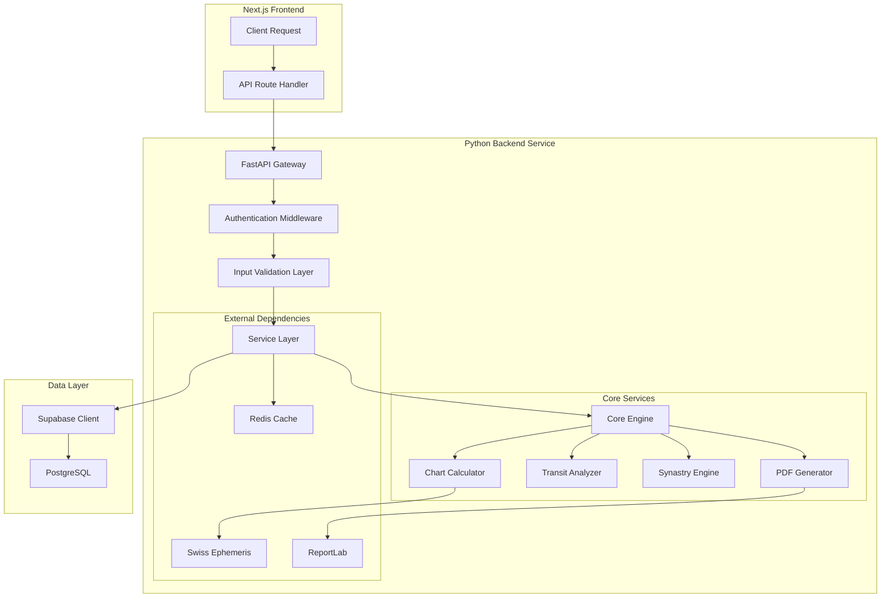

# 🐍 Python Backend Architecture Design Document

## 📋 Overview

The Mystical Realms Python backend is a FastAPI-based microservice responsible for complex astrological calculations, chart generation, and astronomical data processing. It serves as a specialized computation engine that complements the main Next.js application.

## 🏗️ Architecture Overview



## 📁 Project Structure

```python
apps/api/
├── main.py                          # FastAPI application entry point
├── config/
│   ├── __init__.py
│   ├── settings.py                  # Environment configuration
│   ├── database.py                  # Database connection setup
│   └── logging.py                   # Logging configuration
│
├── api/                             # API route handlers
│   ├── __init__.py
│   ├── v1/
│   │   ├── __init__.py
│   │   ├── api.py                   # API router aggregation
│   │   ├── endpoints/
│   │   │   ├── __init__.py
│   │   │   ├── charts.py            # Birth chart endpoints
│   │   │   ├── transits.py          # Transit calculation endpoints
│   │   │   ├── synastry.py          # Relationship compatibility
│   │   │   ├── dice.py              # Astrology dice readings
│   │   │   ├── health.py            # Health check endpoints
│   │   │   └── exports.py           # PDF/SVG export endpoints
│   │   └── dependencies.py          # Shared dependencies
│   └── middleware/
│       ├── __init__.py
│       ├── auth.py                  # Authentication middleware
│       ├── cors.py                  # CORS configuration
│       ├── rate_limit.py            # Rate limiting
│       └── error_handler.py         # Global error handling
│
├── core/                            # Business logic layer
│   ├── __init__.py
│   ├── astrology/
│   │   ├── __init__.py
│   │   ├── calculator.py            # Core calculation engine
│   │   ├── chart_generator.py       # Chart data generation
│   │   ├── transit_calculator.py    # Transit calculations
│   │   ├── synastry_analyzer.py     # Compatibility analysis
│   │   ├── aspect_calculator.py     # Planetary aspects
│   │   └── house_system.py          # House system calculations
│   ├── dice/
│   │   ├── __init__.py
│   │   ├── roller.py                # Dice rolling logic
│   │   └── interpreter.py           # Dice combination meanings
│   └── exports/
│       ├── __init__.py
│       ├── pdf_generator.py         # PDF chart generation
│       ├── svg_generator.py         # SVG chart generation
│       └── templates/               # Chart templates
│           ├── natal_chart.html
│           ├── transit_chart.html
│           └── synastry_chart.html
│
├── services/                        # Service layer
│   ├── __init__.py
│   ├── ephemeris_service.py         # Swiss Ephemeris wrapper
│   ├── cache_service.py             # Redis caching service
│   ├── notification_service.py      # Notification handling
│   └── validation_service.py        # Data validation utilities
│
├── models/                          # Pydantic data models
│   ├── __init__.py
│   ├── base.py                      # Base model classes
│   ├── chart.py                     # Chart-related models
│   ├── transit.py                   # Transit models
│   ├── synastry.py                  # Synastry models
│   ├── dice.py                      # Dice reading models
│   ├── user.py                      # User-related models
│   └── responses.py                 # API response models
│
├── utils/                           # Utility functions
│   ├── __init__.py
│   ├── datetime_utils.py            # Date/time handling
│   ├── coordinate_utils.py          # Geographic calculations
│   ├── file_utils.py                # File handling utilities
│   ├── validation_utils.py          # Validation helpers
│   └── constants.py                 # Application constants
│
├── tests/                           # Test suite
│   ├── __init__.py
│   ├── conftest.py                  # Pytest configuration
│   ├── unit/
│   │   ├── test_calculator.py       # Core calculation tests
│   │   ├── test_chart_generator.py  # Chart generation tests
│   │   ├── test_dice_roller.py      # Dice logic tests
│   │   └── test_utils.py            # Utility function tests
│   ├── integration/
│   │   ├── test_api_endpoints.py    # API endpoint tests
│   │   ├── test_database.py         # Database integration tests
│   │   └── test_cache.py            # Cache integration tests
│   └── fixtures/
│       ├── sample_charts.json       # Test chart data
│       └── sample_responses.json    # Expected API responses
│
├── scripts/                         # Utility scripts
│   ├── init_db.py                   # Database initialization
│   ├── generate_test_data.py        # Test data generation
│   └── health_check.py              # Health monitoring
│
├── requirements/                    # Dependencies
│   ├── base.txt                     # Core dependencies
│   ├── development.txt              # Development dependencies
│   ├── production.txt               # Production dependencies
│   └── testing.txt                  # Testing dependencies
│
├── docker/
│   ├── Dockerfile                   # Production container
│   ├── Dockerfile.dev               # Development container
│   └── docker-compose.yml           # Local development setup
│
├── .env.example                     # Environment variables template
├── .gitignore                       # Git ignore rules
├── pytest.ini                      # Pytest configuration
├── pyproject.toml                   # Python project configuration
└── README.md                        # Service documentation
```

## 🔧 Core Components

### 1. FastAPI Application Setup

```python
from fastapi import FastAPI, Request
from fastapi.middleware.cors import CORSMiddleware
from fastapi.responses import JSONResponse
import logging
from contextlib import asynccontextmanager

from config.settings import get_settings
from config.logging import setup_logging
from api.v1.api import api_router
from api.middleware.error_handler import setup_exception_handlers
from api.middleware.rate_limit import setup_rate_limiting

settings = get_settings()
setup_logging()
logger = logging.getLogger(__name__)

@asynccontextmanager
async def lifespan(app: FastAPI):
    """Application lifespan manager for startup/shutdown events."""
    logger.info("🚀 Starting Mystical Realms Astrology Service")

    # Startup tasks
    await startup_tasks()

    yield

    # Shutdown tasks
    await shutdown_tasks()
    logger.info("🛑 Astrology Service shutdown complete")

async def startup_tasks():
    """Initialize services and connections."""
    # Initialize Swiss Ephemeris
    from services.ephemeris_service import EphemerisService
    ephemeris = EphemerisService()
    await ephemeris.initialize()

    # Initialize cache
    from services.cache_service import CacheService
    cache = CacheService()
    await cache.connect()

    logger.info("✅ All services initialized successfully")

async def shutdown_tasks():
    """Cleanup tasks before shutdown."""
    # Close cache connections
    from services.cache_service import CacheService
    cache = CacheService()
    await cache.disconnect()

# Create FastAPI application
app = FastAPI(
    title="Mystical Realms Astrology API",
    description="Advanced astrological calculations and chart generation service",
    version="1.0.0",
    docs_url="/docs" if settings.DEBUG else None,
    redoc_url="/redoc" if settings.DEBUG else None,
    lifespan=lifespan
)

# CORS middleware
app.add_middleware(
    CORSMiddleware,
    allow_origins=settings.ALLOWED_ORIGINS,
    allow_credentials=True,
    allow_methods=["GET", "POST", "PUT", "DELETE"],
    allow_headers=["*"],
)

# Setup middleware and exception handlers
setup_exception_handlers(app)
setup_rate_limiting(app)

# Include API routes
app.include_router(api_router, prefix="/api/v1")

@app.get("/")
async def root():
    """Root endpoint for health check."""
    return {
        "service": "Mystical Realms Astrology API",
        "version": "1.0.0",
        "status": "operational",
        "docs": "/docs" if settings.DEBUG else "disabled"
    }

@app.get("/health")
async def health_check():
    """Comprehensive health check endpoint."""
    from api.v1.endpoints.health import perform_health_check
    return await perform_health_check()

if __name__ == "__main__":
    import uvicorn
    uvicorn.run(
        "main:app",
        host="0.0.0.0",
        port=8000,
        reload=settings.DEBUG,
        log_level="info"
    )
```

### 2. Configuration Management

```python
from pydantic_settings import BaseSettings
from pydantic import Field, validator
from typing import List, Optional
import os

class Settings(BaseSettings):
    """Application settings with environment variable support."""

    # Application
    APP_NAME: str = "Mystical Realms Astrology API"
    DEBUG: bool = Field(default=False, env="DEBUG")
    VERSION: str = "1.0.0"

    # API Configuration
    API_V1_STR: str = "/api/v1"
    SECRET_KEY: str = Field(..., env="SECRET_KEY")
    ACCESS_TOKEN_EXPIRE_MINUTES: int = Field(default=30, env="ACCESS_TOKEN_EXPIRE_MINUTES")

    # CORS
    ALLOWED_ORIGINS: List[str] = Field(
        default=["http://localhost:3000", "https://mysticalrealms.app"],
        env="ALLOWED_ORIGINS"
    )

    # Database
    SUPABASE_URL: str = Field(..., env="SUPABASE_URL")
    SUPABASE_SERVICE_KEY: str = Field(..., env="SUPABASE_SERVICE_KEY")

    # Redis Cache
    REDIS_URL: str = Field(default="redis://localhost:6379", env="REDIS_URL")
    CACHE_TTL: int = Field(default=3600, env="CACHE_TTL")  # 1 hour

    # Swiss Ephemeris
    EPHEMERIS_PATH: str = Field(default="./ephemeris", env="EPHEMERIS_PATH")

    # External APIs
    OPENAI_API_KEY: Optional[str] = Field(default=None, env="OPENAI_API_KEY")

    # Rate Limiting
    RATE_LIMIT_REQUESTS: int = Field(default=100, env="RATE_LIMIT_REQUESTS")
    RATE_LIMIT_WINDOW: int = Field(default=3600, env="RATE_LIMIT_WINDOW")  # 1 hour

    # File Storage
    UPLOAD_DIR: str = Field(default="./uploads", env="UPLOAD_DIR")
    MAX_FILE_SIZE: int = Field(default=10 * 1024 * 1024, env="MAX_FILE_SIZE")  # 10MB

    # Logging
    LOG_LEVEL: str = Field(default="INFO", env="LOG_LEVEL")
    LOG_FORMAT: str = Field(
        default="%(asctime)s - %(name)s - %(levelname)s - %(message)s",
        env="LOG_FORMAT"
    )

    @validator("ALLOWED_ORIGINS", pre=True)
    def parse_cors_origins(cls, v):
        """Parse CORS origins from string or list."""
        if isinstance(v, str):
            return [origin.strip() for origin in v.split(",")]
        return v

    @validator("EPHEMERIS_PATH")
    def ensure_ephemeris_path_exists(cls, v):
        """Ensure ephemeris directory exists."""
        os.makedirs(v, exist_ok=True)
        return v

    @validator("UPLOAD_DIR")
    def ensure_upload_dir_exists(cls, v):
        """Ensure upload directory exists."""
        os.makedirs(v, exist_ok=True)
        return v

    class Config:
        env_file = ".env"
        case_sensitive = True

# Global settings instance
_settings: Optional[Settings] = None

def get_settings() -> Settings:
    """Get cached settings instance."""
    global _settings
    if _settings is None:
        _settings = Settings()
    return _settings
```

### 3. Core Astrology Calculator

```python
from typing import Dict, List, Optional, Tuple
from datetime import datetime, date, time
from dataclasses import dataclass
import swisseph as swe
import math
import logging

from models.chart import (
    ChartRequest, ChartResponse, Planet, House, Aspect,
    ChartType, HouseSystem, AspectType
)
from services.ephemeris_service import EphemerisService
from utils.coordinate_utils import get_timezone_offset
from utils.datetime_utils import datetime_to_julian_day

logger = logging.getLogger(__name__)

@dataclass
class ChartCalculationResult:
    """Result of astrological chart calculation."""
    planets: List[Planet]
    houses: List[House]
    aspects: List[Aspect]
    chart_metadata: Dict

class AstrologyCalculator:
    """Core astrological calculation engine using Swiss Ephemeris."""

    def __init__(self, ephemeris_service: EphemerisService):
        self.ephemeris = ephemeris_service
        self.house_systems = {
            HouseSystem.PLACIDUS: b'P',
            HouseSystem.KOCH: b'K',
            HouseSystem.EQUAL: b'E',
            HouseSystem.WHOLE_SIGN: b'W',
            HouseSystem.CAMPANUS: b'C'
        }

        self.planets_swe = {
            'Sun': swe.SUN,
            'Moon': swe.MOON,
            'Mercury': swe.MERCURY,
            'Venus': swe.VENUS,
            'Mars': swe.MARS,
            'Jupiter': swe.JUPITER,
            'Saturn': swe.SATURN,
            'Uranus': swe.URANUS,
            'Neptune': swe.NEPTUNE,
            'Pluto': swe.PLUTO,
            'North Node': swe.TRUE_NODE,
            'South Node': swe.TRUE_NODE,  # Calculate opposite
            'Chiron': swe.CHIRON,
            'Lilith': swe.MEAN_APOG
        }

        self.aspect_orbs = {
            AspectType.CONJUNCTION: 8.0,
            AspectType.OPPOSITION: 8.0,
            AspectType.SQUARE: 6.0,
            AspectType.TRINE: 6.0,
            AspectType.SEXTILE: 4.0,
            AspectType.QUINCUNX: 3.0,
            AspectType.SEMISQUARE: 2.0,
            AspectType.SESQUISQUARE: 2.0
        }

    async def calculate_chart(self, request: ChartRequest) -> ChartResponse:
        """Calculate a complete astrological chart."""
        try:
            logger.info(f"Calculating {request.chart_type} chart for {request.name}")

            # Convert datetime to Julian Day
            julian_day = self._datetime_to_julian_day(
                request.birth_date,
                request.birth_time,
                request.latitude,
                request.longitude
            )

            # Calculate planetary positions
            planets = await self._calculate_planets(julian_day)

            # Calculate houses
            houses = await self._calculate_houses(
                julian_day,
                request.latitude,
                request.longitude,
                request.house_system or HouseSystem.PLACIDUS
            )

            # Calculate aspects
            aspects = await self._calculate_aspects(planets)

            # Generate chart metadata
            metadata = self._generate_chart_metadata(request, julian_day)

            return ChartResponse(
                chart_id=request.chart_id,
                chart_type=request.chart_type,
                name=request.name,
                birth_date=request.birth_date,
                birth_time=request.birth_time,
                birth_location=request.birth_location,
                latitude=request.latitude,
                longitude=request.longitude,
                planets=planets,
                houses=houses,
                aspects=aspects,
                metadata=metadata,
                calculation_time=datetime.utcnow()
            )

        except Exception as e:
            logger.error(f"Chart calculation failed: {str(e)}")
            raise

    async def _calculate_planets(self, julian_day: float) -> List[Planet]:
        """Calculate planetary positions for given Julian Day."""
        planets = []

        for planet_name, planet_id in self.planets_swe.items():
            try:
                # Calculate position
                position, speed = swe.calc_ut(julian_day, planet_id)
                longitude = position[0]
                latitude = position[1]
                distance = position[2]

                # Handle South Node (opposite of North Node)
                if planet_name == 'South Node':
                    longitude = (longitude + 180) % 360

                # Calculate additional properties
                sign = self._longitude_to_sign(longitude)
                degree = longitude % 30
                house = None  # Will be set later when houses are calculated

                planet = Planet(
                    name=planet_name,
                    longitude=longitude,
                    latitude=latitude,
                    distance=distance,
                    speed=speed[0],
                    sign=sign,
                    degree=degree,
                    house=house,
                    is_retrograde=speed[0] < 0
                )

                planets.append(planet)

            except Exception as e:
                logger.warning(f"Failed to calculate {planet_name}: {str(e)}")
                continue

        return planets

    async def _calculate_houses(
        self,
        julian_day: float,
        latitude: float,
        longitude: float,
        house_system: HouseSystem
    ) -> List[House]:
        """Calculate house cusps and assign planets to houses."""
        try:
            system_code = self.house_systems.get(house_system, b'P')

            # Calculate house cusps
            cusps, ascmc = swe.houses(julian_day, latitude, longitude, system_code)

            houses = []
            for i in range(12):
                house_number = i + 1
                cusp_longitude = cusps[i]

                house = House(
                    number=house_number,
                    cusp_longitude=cusp_longitude,
                    sign=self._longitude_to_sign(cusp_longitude),
                    planets=[]  # Will be populated later
                )
                houses.append(house)

            # Store angles (Ascendant, MC, etc.)
            self.angles = {
                'Ascendant': ascmc[0],
                'MC': ascmc[1],
                'Descendant': (ascmc[0] + 180) % 360,
                'IC': (ascmc[1] + 180) % 360
            }

            return houses

        except Exception as e:
            logger.error(f"House calculation failed: {str(e)}")
            raise

    async def _calculate_aspects(self, planets: List[Planet]) -> List[Aspect]:
        """Calculate aspects between planets."""
        aspects = []

        for i, planet1 in enumerate(planets):
            for planet2 in planets[i + 1:]:
                aspect = self._calculate_aspect_between_planets(planet1, planet2)
                if aspect:
                    aspects.append(aspect)

        return aspects

    def _calculate_aspect_between_planets(
        self,
        planet1: Planet,
        planet2: Planet
    ) -> Optional[Aspect]:
        """Calculate aspect between two planets."""
        # Calculate angular separation
        separation = abs(planet1.longitude - planet2.longitude)
        if separation > 180:
            separation = 360 - separation

        # Check each aspect type
        for aspect_type, aspect_angle in self._get_aspect_angles().items():
            orb = self.aspect_orbs.get(aspect_type, 2.0)

            if abs(separation - aspect_angle) <= orb:
                return Aspect(
                    planet1=planet1.name,
                    planet2=planet2.name,
                    aspect_type=aspect_type,
                    angle=aspect_angle,
                    orb=abs(separation - aspect_angle),
                    is_applying=self._is_applying_aspect(planet1, planet2, aspect_angle),
                    strength=self._calculate_aspect_strength(
                        abs(separation - aspect_angle), orb
                    )
                )

        return None

    def _get_aspect_angles(self) -> Dict[AspectType, float]:
        """Get aspect angles mapping."""
        return {
            AspectType.CONJUNCTION: 0.0,
            AspectType.SEXTILE: 60.0,
            AspectType.SQUARE: 90.0,
            AspectType.TRINE: 120.0,
            AspectType.QUINCUNX: 150.0,
            AspectType.OPPOSITION: 180.0,
            AspectType.SEMISQUARE: 45.0,
            AspectType.SESQUISQUARE: 135.0
        }

    def _longitude_to_sign(self, longitude: float) -> str:
        """Convert longitude to zodiac sign."""
        signs = [
            "Aries", "Taurus", "Gemini", "Cancer", "Leo", "Virgo",
            "Libra", "Scorpio", "Sagittarius", "Capricorn", "Aquarius", "Pisces"
        ]
        sign_index = int(longitude // 30)
        return signs[sign_index]

    def _datetime_to_julian_day(
        self,
        birth_date: date,
        birth_time: time,
        latitude: float,
        longitude: float
    ) -> float:
        """Convert birth date/time to Julian Day Number."""
        # Get timezone offset for coordinates
        timezone_offset = get_timezone_offset(latitude, longitude, birth_date)

        # Convert to UTC
        dt = datetime.combine(birth_date, birth_time)
        utc_dt = dt - timezone_offset

        # Convert to Julian Day
        return datetime_to_julian_day(utc_dt)

    def _is_applying_aspect(
        self,
        planet1: Planet,
        planet2: Planet,
        aspect_angle: float
    ) -> bool:
        """Determine if aspect is applying or separating."""
        # This is a simplified calculation
        # In reality, this requires more complex orbital mechanics
        faster_planet = planet1 if abs(planet1.speed) > abs(planet2.speed) else planet2
        slower_planet = planet2 if faster_planet == planet1 else planet1

        # Check if faster planet is moving toward the aspect
        current_separation = abs(planet1.longitude - planet2.longitude)
        if current_separation > 180:
            current_separation = 360 - current_separation

        return abs(current_separation - aspect_angle) > 0.1  # Simplified logic

    def _calculate_aspect_strength(self, orb_difference: float, max_orb: float) -> float:
        """Calculate aspect strength based on orb tightness."""
        return max(0.0, 1.0 - (orb_difference / max_orb))

    def _generate_chart_metadata(
        self,
        request: ChartRequest,
        julian_day: float
    ) -> Dict:
        """Generate additional chart metadata."""
        return {
            'julian_day': julian_day,
            'house_system': request.house_system.value if request.house_system else 'placidus',
            'timezone': get_timezone_offset(request.latitude, request.longitude, request.birth_date).total_seconds() / 3600,
            'angles': getattr(self, 'angles', {}),
            'calculation_accuracy': 'high',
            'ephemeris_version': swe.get_library_path()
        }
```

### 4. API Endpoint Example

```python
from fastapi import APIRouter, Depends, HTTPException, BackgroundTasks
from fastapi.responses import FileResponse
from typing import List, Optional
import logging
from uuid import UUID, uuid4

from models.chart import ChartRequest, ChartResponse, ChartType
from models.responses import ErrorResponse, SuccessResponse
from core.astrology.calculator import AstrologyCalculator
from core.exports.pdf_generator import PDFGenerator
from services.cache_service import CacheService
from services.ephemeris_service import EphemerisService
from api.v1.dependencies import get_current_user, get_calculator, get_cache

router = APIRouter(prefix="/charts", tags=["charts"])
logger = logging.getLogger(__name__)

@router.post("/calculate", response_model=ChartResponse)
async def calculate_chart(
    request: ChartRequest,
    background_tasks: BackgroundTasks,
    calculator: AstrologyCalculator = Depends(get_calculator),
    cache: CacheService = Depends(get_cache),
    current_user: dict = Depends(get_current_user)
):
    """Calculate astrological chart with caching support."""
    try:
        # Generate cache key
        cache_key = f"chart:{request.chart_type}:{request.birth_date}:{request.birth_time}:{request.latitude}:{request.longitude}"

        # Check cache first
        cached_result = await cache.get(cache_key)
        if cached_result:
            logger.info(f"Returning cached chart for user {current_user['id']}")
            return ChartResponse.parse_obj(cached_result)

        # Calculate chart
        chart_response = await calculator.calculate_chart(request)

        # Cache result
        background_tasks.add_task(
            cache.set,
            cache_key,
            chart_response.dict(),
            ttl=3600  # 1 hour
        )

        # Log calculation
        logger.info(f"Chart calculated for user {current_user['id']}: {chart_response.chart_id}")

        return chart_response

    except Exception as e:
        logger.error(f"Chart calculation failed: {str(e)}")
        raise HTTPException(
            status_code=500,
            detail=f"Chart calculation failed: {str(e)}"
        )

@router.post("/natal", response_model=ChartResponse)
async def calculate_natal_chart(
    request: ChartRequest,
    calculator: AstrologyCalculator = Depends(get_calculator),
    current_user: dict = Depends(get_current_user)
):
    """Calculate natal (birth) chart specifically."""
    request.chart_type = ChartType.NATAL
    return await calculate_chart(request, BackgroundTasks(), calculator, get_cache(), current_user)

@router.post("/transit", response_model=ChartResponse)
async def calculate_transit_chart(
    natal_request: ChartRequest,
    transit_date: str,
    calculator: AstrologyCalculator = Depends(get_calculator),
    current_user: dict = Depends(get_current_user)
):
    """Calculate transit chart for specific date."""
    # Implementation for transit calculations
    pass

@router.post("/synastry", response_model=ChartResponse)
async def calculate_synastry_chart(
    person1: ChartRequest,
    person2: ChartRequest,
    calculator: AstrologyCalculator = Depends(get_calculator),
    current_user: dict = Depends(get_current_user)
):
    """Calculate synastry (compatibility) chart between two people."""
    # Implementation for synastry calculations
    pass

@router.get("/export/{chart_id}/pdf")
async def export_chart_pdf(
    chart_id: UUID,
    pdf_generator: PDFGenerator = Depends(),
    current_user: dict = Depends(get_current_user)
):
    """Export chart as PDF."""
    try:
        # Get chart data from database
        # Generate PDF
        pdf_path = await pdf_generator.generate_chart_pdf(chart_id)

        return FileResponse(
            path=pdf_path,
            media_type="application/pdf",
            filename=f"chart_{chart_id}.pdf"
        )

    except Exception as e:
        logger.error(f"PDF export failed: {str(e)}")
        raise HTTPException(
            status_code=500,
            detail=f"PDF export failed: {str(e)}"
        )

@router.get("/types", response_model=List[str])
async def get_chart_types():
    """Get available chart types."""
    return [chart_type.value for chart_type in ChartType]

@router.get("/house-systems", response_model=List[str])
async def get_house_systems():
    """Get available house systems."""
    from models.chart import HouseSystem
    return [system.value for system in HouseSystem]
```

### 5. Data Models

```python
from pydantic import BaseModel, Field, validator
from typing import List, Optional, Dict, Any
from datetime import datetime, date, time
from enum import Enum
from uuid import UUID, uuid4

class ChartType(str, Enum):
    """Available chart types."""
    NATAL = "natal"
    TRANSIT = "transit"
    SYNASTRY = "synastry"
    COMPOSITE = "composite"
    PROGRESSED = "progressed"

class HouseSystem(str, Enum):
    """Available house systems."""
    PLACIDUS = "placidus"
    KOCH = "koch"
    EQUAL = "equal"
    WHOLE_SIGN = "whole_sign"
    CAMPANUS = "campanus"

class AspectType(str, Enum):
    """Planetary aspect types."""
    CONJUNCTION = "conjunction"
    SEXTILE = "sextile"
    SQUARE = "square"
    TRINE = "trine"
    QUINCUNX = "quincunx"
    OPPOSITION = "opposition"
    SEMISQUARE = "semisquare"
    SESQUISQUARE = "sesquisquare"

class Planet(BaseModel):
    """Individual planet data."""
    name: str
    longitude: float = Field(..., ge=0, le=360)
    latitude: float = Field(..., ge=-90, le=90)
    distance: float = Field(..., gt=0)
    speed: float
    sign: str
    degree: float = Field(..., ge=0, lt=30)
    house: Optional[int] = Field(None, ge=1, le=12)
    is_retrograde: bool = False

    class Config:
        schema_extra = {
            "example": {
                "name": "Sun",
                "longitude": 285.5,
                "latitude": 0.0,
                "distance": 1.0,
                "speed": 0.98,
                "sign": "Capricorn",
                "degree": 15.5,
                "house": 10,
                "is_retrograde": False
            }
        }

class House(BaseModel):
    """Astrological house data."""
    number: int = Field(..., ge=1, le=12)
    cusp_longitude: float = Field(..., ge=0, le=360)
    sign: str
    planets: List[str] = Field(default_factory=list)

    class Config:
        schema_extra = {
            "example": {
                "number": 1,
                "cusp_longitude": 120.0,
                "sign": "Leo",
                "planets": ["Sun", "Mercury"]
            }
        }

class Aspect(BaseModel):
    """Planetary aspect data."""
    planet1: str
    planet2: str
    aspect_type: AspectType
    angle: float
    orb: float = Field(..., ge=0, le=10)
    is_applying: bool
    strength: float = Field(..., ge=0, le=1)

    class Config:
        schema_extra = {
            "example": {
                "planet1": "Sun",
                "planet2": "Moon",
                "aspect_type": "trine",
                "angle": 120.0,
                "orb": 2.5,
                "is_applying": True,
                "strength": 0.8
            }
        }

class ChartRequest(BaseModel):
    """Request model for chart calculation."""
    chart_id: Optional[UUID] = Field(default_factory=uuid4)
    chart_type: ChartType
    name: str = Field(..., min_length=1, max_length=100)
    birth_date: date
    birth_time: time
    birth_location: str = Field(..., min_length=1, max_length=200)
    latitude: float = Field(..., ge=-90, le=90)
    longitude: float = Field(..., ge=-180, le=180)
    house_system: Optional[HouseSystem] = HouseSystem.PLACIDUS

    @validator('birth_date')
    def validate_birth_date(cls, v):
        """Validate birth date is not in the future."""
        if v > date.today():
            raise ValueError('Birth date cannot be in the future')
        return v

    @validator('name')
    def validate_name(cls, v):
        """Validate and clean name."""
        return v.strip().title()

    class Config:
        schema_extra = {
            "example": {
                "chart_type": "natal",
                "name": "John Doe",
                "birth_date": "1990-06-15",
                "birth_time": "14:30:00",
                "birth_location": "New York, NY, USA",
                "latitude": 40.7128,
                "longitude": -74.0060,
                "house_system": "placidus"
            }
        }

class ChartResponse(BaseModel):
    """Response model for calculated chart."""
    chart_id: UUID
    chart_type: ChartType
    name: str
    birth_date: date
    birth_time: time
    birth_location: str
    latitude: float
    longitude: float
    planets: List[Planet]
    houses: List[House]
    aspects: List[Aspect]
    metadata: Dict[str, Any]
    calculation_time: datetime

    class Config:
        schema_extra = {
            "example": {
                "chart_id": "123e4567-e89b-12d3-a456-426614174000",
                "chart_type": "natal",
                "name": "John Doe",
                "birth_date": "1990-06-15",
                "birth_time": "14:30:00",
                "birth_location": "New York, NY, USA",
                "latitude": 40.7128,
                "longitude": -74.0060,
                "planets": [],
                "houses": [],
                "aspects": [],
                "metadata": {},
                "calculation_time": "2024-01-15T10:30:00Z"
            }
        }
```

### 6. Testing Strategy

```python
import pytest
import asyncio
from fastapi.testclient import TestClient
from unittest.mock import Mock, AsyncMock
import os
from datetime import date, time

from main import app
from config.settings import get_settings
from services.ephemeris_service import EphemerisService
from services.cache_service import CacheService

# Test configuration
os.environ["TESTING"] = "true"
os.environ["SUPABASE_URL"] = "http://localhost:54321"
os.environ["SUPABASE_SERVICE_KEY"] = "test-key"
os.environ["SECRET_KEY"] = "test-secret-key"

@pytest.fixture
def client():
    """FastAPI test client."""
    return TestClient(app)

@pytest.fixture
def mock_ephemeris():
    """Mock ephemeris service."""
    mock = Mock(spec=EphemerisService)
    mock.initialize = AsyncMock()
    return mock

@pytest.fixture
def mock_cache():
    """Mock cache service."""
    mock = Mock(spec=CacheService)
    mock.get = AsyncMock(return_value=None)
    mock.set = AsyncMock()
    mock.connect = AsyncMock()
    mock.disconnect = AsyncMock()
    return mock

@pytest.fixture
def sample_chart_request():
    """Sample chart request for testing."""
    return {
        "chart_type": "natal",
        "name": "Test User",
        "birth_date": "1990-06-15",
        "birth_time": "14:30:00",
        "birth_location": "New York, NY, USA",
        "latitude": 40.7128,
        "longitude": -74.0060,
        "house_system": "placidus"
    }

@pytest.fixture
def sample_planets():
    """Sample planet data for testing."""
    return [
        {
            "name": "Sun",
            "longitude": 84.5,
            "latitude": 0.0,
            "distance": 1.0,
            "speed": 0.98,
            "sign": "Gemini",
            "degree": 24.5,
            "house": 1,
            "is_retrograde": False
        },
        {
            "name": "Moon",
            "longitude": 150.0,
            "latitude": 2.5,
            "distance": 0.002,
            "speed": 13.2,
            "sign": "Virgo",
            "degree": 0.0,
            "house": 4,
            "is_retrograde": False
        }
    ]

@pytest.fixture
def authenticated_headers():
    """Headers for authenticated requests."""
    return {"Authorization": "Bearer test-token"}

@pytest.fixture(scope="session")
def event_loop():
    """Create an instance of the default event loop for the test session."""
    loop = asyncio.get_event_loop_policy().new_event_loop()
    yield loop
    loop.close()
```

```python
import pytest
from unittest.mock import Mock, patch, AsyncMock
from datetime import date, time
import swisseph as swe

from core.astrology.calculator import AstrologyCalculator
from models.chart import ChartRequest, ChartType, HouseSystem
from services.ephemeris_service import EphemerisService

class TestAstrologyCalculator:
    """Test cases for the astrology calculator."""

    @pytest.fixture
    def mock_ephemeris_service(self):
        """Mock ephemeris service."""
        return Mock(spec=EphemerisService)

    @pytest.fixture
    def calculator(self, mock_ephemeris_service):
        """Calculator instance with mocked dependencies."""
        return AstrologyCalculator(mock_ephemeris_service)

    @pytest.fixture
    def sample_request(self):
        """Sample chart calculation request."""
        return ChartRequest(
            chart_type=ChartType.NATAL,
            name="Test User",
            birth_date=date(1990, 6, 15),
            birth_time=time(14, 30, 0),
            birth_location="New York, NY, USA",
            latitude=40.7128,
            longitude=-74.0060,
            house_system=HouseSystem.PLACIDUS
        )

    @patch('swisseph.calc_ut')
    @patch('swisseph.houses')
    async def test_calculate_chart_success(
        self,
        mock_houses,
        mock_calc_ut,
        calculator,
        sample_request
    ):
        """Test successful chart calculation."""
        # Mock Swiss Ephemeris responses
        mock_calc_ut.return_value = ([120.5, 0.0, 1.0], [0.98, 0.0, 0.0])
        mock_houses.return_value = (
            [0, 30, 60, 90, 120, 150, 180, 210, 240, 270, 300, 330],
            [15.5, 105.2, 195.5, 285.2]  # Ascendant, MC, Descendant, IC
        )

        # Calculate chart
        result = await calculator.calculate_chart(sample_request)

        # Assertions
        assert result.chart_type == ChartType.NATAL
        assert result.name == "Test User"
        assert len(result.planets) > 0
        assert len(result.houses) == 12
        assert result.calculation_time is not None

        # Verify Swiss Ephemeris was called
        assert mock_calc_ut.called
        assert mock_houses.called

    def test_longitude_to_sign(self, calculator):
        """Test longitude to zodiac sign conversion."""
        test_cases = [
            (0.0, "Aries"),
            (30.0, "Taurus"),
            (60.0, "Gemini"),
            (90.0, "Cancer"),
            (120.0, "Leo"),
            (150.0, "Virgo"),
            (180.0, "Libra"),
            (210.0, "Scorpio"),
            (240.0, "Sagittarius"),
            (270.0, "Capricorn"),
            (300.0, "Aquarius"),
            (330.0, "Pisces"),
            (359.9, "Pisces")
        ]

        for longitude, expected_sign in test_cases:
            result = calculator._longitude_to_sign(longitude)
            assert result == expected_sign, f"Expected {expected_sign} for {longitude}°"

    async def test_calculate_aspects(self, calculator, sample_planets):
        """Test aspect calculation between planets."""
        from models.chart import Planet

        planets = [
            Planet(
                name="Sun",
                longitude=0.0,
                latitude=0.0,
                distance=1.0,
                speed=0.98,
                sign="Aries",
                degree=0.0,
                is_retrograde=False
            ),
            Planet(
                name="Moon",
                longitude=120.0,
                latitude=0.0,
                distance=0.002,
                speed=13.2,
                sign="Leo",
                degree=0.0,
                is_retrograde=False
            )
        ]

        aspects = await calculator._calculate_aspects(planets)

        # Should find a trine aspect (120 degrees)
        assert len(aspects) > 0
        trine_aspect = next((a for a in aspects if a.aspect_type.value == "trine"), None)
        assert trine_aspect is not None
        assert trine_aspect.planet1 == "Sun"
        assert trine_aspect.planet2 == "Moon"

    @pytest.mark.parametrize("chart_type", [
        ChartType.NATAL,
        ChartType.TRANSIT,
        ChartType.SYNASTRY
    ])
    async def test_different_chart_types(self, calculator, sample_request, chart_type):
        """Test calculation for different chart types."""
        sample_request.chart_type = chart_type

        with patch('swisseph.calc_ut') as mock_calc, \
             patch('swisseph.houses') as mock_houses:

            mock_calc.return_value = ([120.5, 0.0, 1.0], [0.98, 0.0, 0.0])
            mock_houses.return_value = (
                [0, 30, 60, 90, 120, 150, 180, 210, 240, 270, 300, 330],
                [15.5, 105.2, 195.5, 285.2]
            )

            result = await calculator.calculate_chart(sample_request)
            assert result.chart_type == chart_type

    def test_aspect_strength_calculation(self, calculator):
        """Test aspect strength calculation based on orb."""
        # Perfect aspect (0 orb difference)
        strength = calculator._calculate_aspect_strength(0.0, 6.0)
        assert strength == 1.0

        # Half orb
        strength = calculator._calculate_aspect_strength(3.0, 6.0)
        assert strength == 0.5

        # Maximum orb
        strength = calculator._calculate_aspect_strength(6.0, 6.0)
        assert strength == 0.0

        # Beyond maximum orb
        strength = calculator._calculate_aspect_strength(8.0, 6.0)
        assert strength == 0.0
```

## 🔧 Key Features

### 1. **Modular Architecture**

- Clear separation of concerns
- Dependency injection pattern
- Pluggable services and components

### 2. **Swiss Ephemeris Integration**

- High-precision astronomical calculations
- Support for all major planetary bodies
- Multiple house system support

### 3. **Caching Strategy**

- Redis-based caching for expensive calculations
- Intelligent cache invalidation
- Performance optimization

### 4. **Comprehensive Testing**

- Unit tests for core calculations
- Integration tests for API endpoints
- Mock Swiss Ephemeris for testing

### 5. **Security & Performance**

- JWT authentication integration
- Rate limiting middleware
- Input validation with Pydantic
- Async/await throughout

### 6. **Export Capabilities**

- PDF chart generation
- SVG chart exports
- Multiple chart formats

## 🚀 Deployment

### Docker Configuration

```dockerfile
FROM python:3.11-slim

# Set working directory
WORKDIR /app

# Install system dependencies
RUN apt-get update && apt-get install -y \
    gcc \
    g++ \
    make \
    curl \
    && rm -rf /var/lib/apt/lists/*

# Copy requirements
COPY requirements/production.txt .
RUN pip install --no-cache-dir -r production.txt

# Copy application
COPY . .

# Create directories
RUN mkdir -p ephemeris uploads logs

# Set environment variables
ENV PYTHONPATH=/app
ENV PYTHONUNBUFFERED=1

# Expose port
EXPOSE 8000

# Health check
HEALTHCHECK --interval=30s --timeout=30s --start-period=5s --retries=3 \
    CMD curl -f http://localhost:8000/health || exit 1

# Run application
CMD ["uvicorn", "main:app", "--host", "0.0.0.0", "--port", "8000"]
```

### Production Considerations

1. **Environment Variables**: All sensitive configuration via environment variables
2. **Logging**: Structured logging with proper log levels
3. **Monitoring**: Health check endpoints and metrics collection
4. **Scaling**: Stateless design for horizontal scaling
5. **Security**: HTTPS only, CORS configuration, input validation

This architecture provides a robust, scalable foundation for the astrological calculation service while maintaining clean separation of concerns and comprehensive testing coverage.

Similar code found with 1 license type
