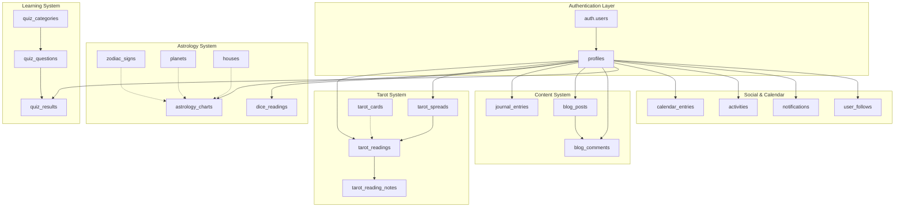

# 🔮 Mystical Realms - Database Schema Documentation

This document provides comprehensive documentation for the Mystical Realms Supabase PostgreSQL database schema, including table structures, relationships, indexing strategy, Row Level Security (RLS) policies, and performance optimizations.

## 📋 Table of Contents

- [Overview](#overview)
- [Database Architecture](#database-architecture)
- [Core Tables](#core-tables)
- [Reference Tables](#reference-tables)
- [Relationships & Constraints](#relationships--constraints)
- [Indexing Strategy](#indexing-strategy)
- [Row Level Security (RLS)](#row-level-security-rls)
- [Performance Optimizations](#performance-optimizations)
- [Migration Files](#migration-files)
- [Usage Examples](#usage-examples)

## 🏗️ Overview

The Mystical Realms database is designed to support a comprehensive Tarot & Astrology platform with the following core features:

- **User Management**: Profiles, followers, and social features
- **Tarot System**: Cards, spreads, readings, and interpretations
- **Astrology System**: Charts, calculations, and dice readings
- **Content Management**: Journals, blogs, and user-generated content
- **Learning System**: Quizzes, categories, and progress tracking
- **Calendar**: Personal events, birthdays, and reminders
- **Social Features**: Activities, notifications, and community interactions

### 🎯 Design Principles

1. **Security First**: All user tables implement Row Level Security (RLS)
2. **Performance Optimized**: Comprehensive indexing strategy for fast queries
3. **Scalable**: JSONB columns for flexible data storage
4. **Referential Integrity**: Foreign key constraints ensure data consistency
5. **Audit Trail**: Automatic timestamps and update tracking
6. **Type Safety**: Strong typing with CHECK constraints

## 🏛️ Database Architecture



## 📊 Core Tables

### 👤 User System

#### `profiles`

Extends Supabase Auth with user profile information.

```sql
CREATE TABLE profiles (
    id UUID PRIMARY KEY REFERENCES auth.users(id) ON DELETE CASCADE,
    username TEXT UNIQUE NOT NULL,
    display_name TEXT,
    bio TEXT,
    avatar_url TEXT,
    status TEXT DEFAULT 'active' CHECK (status IN ('active', 'inactive', 'suspended')),
    badges JSONB DEFAULT '[]'::jsonb,
    preferences JSONB DEFAULT '{}'::jsonb,
    last_active_at TIMESTAMP WITH TIME ZONE DEFAULT NOW(),
    created_at TIMESTAMP WITH TIME ZONE DEFAULT NOW(),
    updated_at TIMESTAMP WITH TIME ZONE DEFAULT NOW()
);
```

**Key Features:**

- Links to Supabase auth.users
- Flexible JSONB for badges and preferences
- Status management for moderation
- Automatic timestamp tracking

#### `user_follows`

Social following system between users.

```sql
CREATE TABLE user_follows (
    id UUID PRIMARY KEY DEFAULT gen_random_uuid(),
    follower_id UUID NOT NULL REFERENCES profiles(id) ON DELETE CASCADE,
    following_id UUID NOT NULL REFERENCES profiles(id) ON DELETE CASCADE,
    created_at TIMESTAMP WITH TIME ZONE DEFAULT NOW(),
    CONSTRAINT no_self_follow CHECK (follower_id != following_id),
    CONSTRAINT unique_follow UNIQUE (follower_id, following_id)
);
```

### 🃏 Tarot System

#### `tarot_cards`

Complete reference of all 78 tarot cards with upright and reversed meanings and keywords.

```sql
CREATE TABLE tarot_cards (
    id SERIAL PRIMARY KEY,
    name TEXT NOT NULL,
    suit TEXT NOT NULL CHECK (suit IN ('Major', 'Wands', 'Cups', 'Swords', 'Pentacles')),
    number TEXT,
    keywords TEXT[] DEFAULT '{}', -- upright keywords
    reversed_keywords TEXT[] DEFAULT '{}', -- reversed keywords
    upright_meaning TEXT NOT NULL,
    reversed_meaning TEXT NOT NULL,
    image_url TEXT,
    order_index INTEGER NOT NULL UNIQUE,
    metadata JSONB DEFAULT '{}'::jsonb,
    created_at TIMESTAMP WITH TIME ZONE DEFAULT NOW()
);
```

#### `tarot_spreads`

Custom and default tarot spreads with layout information.

```sql
CREATE TABLE tarot_spreads (
    id UUID PRIMARY KEY DEFAULT gen_random_uuid(),
    user_id UUID NOT NULL REFERENCES profiles(id) ON DELETE CASCADE,
    name TEXT NOT NULL,
    description TEXT,
    is_public BOOLEAN DEFAULT false,
    layout JSONB NOT NULL DEFAULT '[]'::jsonb,
    position_count INTEGER NOT NULL DEFAULT 1,
    tags TEXT[] DEFAULT '{}',
    usage_count INTEGER DEFAULT 0,
    rating DECIMAL(3,2) DEFAULT 0.00,
    created_at TIMESTAMP WITH TIME ZONE DEFAULT NOW(),
    updated_at TIMESTAMP WITH TIME ZONE DEFAULT NOW()
);
```

**Layout JSONB Structure:**

```json
[
  {
    "position": 1,
    "name": "Past",
    "description": "What has led to this situation",
    "x": 100,
    "y": 150,
    "rotation": 0
  }
]
```

#### `tarot_readings`

Individual tarot readings with card data and AI interpretations.

```sql
CREATE TABLE tarot_readings (
    id UUID PRIMARY KEY DEFAULT gen_random_uuid(),
    user_id UUID NOT NULL REFERENCES profiles(id) ON DELETE CASCADE,
    spread_id UUID REFERENCES tarot_spreads(id) ON DELETE SET NULL,
    title TEXT NOT NULL,
    question TEXT,
    deck_type TEXT DEFAULT 'Rider-Waite',
    include_reversals BOOLEAN DEFAULT true,
    arcana_type TEXT DEFAULT 'full' CHECK (arcana_type IN ('full', 'major', 'minor')),
    card_data JSONB NOT NULL DEFAULT '[]'::jsonb,
    ai_interpretation TEXT,
    interpretation_model TEXT,
    is_public BOOLEAN DEFAULT false,
    is_favorite BOOLEAN DEFAULT false,
    source TEXT DEFAULT 'live' CHECK (source IN ('live', 'imported', 'demo')),
    status TEXT DEFAULT 'completed' CHECK (status IN ('draft', 'completed', 'archived')),
    reading_date TIMESTAMP WITH TIME ZONE DEFAULT NOW(),
    created_at TIMESTAMP WITH TIME ZONE DEFAULT NOW(),
    updated_at TIMESTAMP WITH TIME ZONE DEFAULT NOW()
);
```

**Card Data JSONB Structure:**

```json
[
  {
    "position": 1,
    "card_id": 1,
    "card_name": "The Fool",
    "is_reversed": false,
    "interpretation": "New beginnings await..."
  }
]
```

### ⭐ Astrology System

#### `astrology_charts`

Birth charts, transit charts, and synastry analyses.

```sql
CREATE TABLE astrology_charts (
    id UUID PRIMARY KEY DEFAULT gen_random_uuid(),
    user_id UUID NOT NULL REFERENCES profiles(id) ON DELETE CASCADE,
    chart_type TEXT NOT NULL CHECK (chart_type IN ('natal', 'transit', 'synastry', 'composite', 'progressed')),
    name TEXT NOT NULL,
    birth_date DATE,
    birth_time TIME,
    birth_location TEXT,
    latitude DECIMAL(10, 8),
    longitude DECIMAL(11, 8),
    timezone TEXT,
    chart_data JSONB DEFAULT '{}'::jsonb,
    pdf_url TEXT,
    svg_url TEXT,
    is_public BOOLEAN DEFAULT false,
    calculation_status TEXT DEFAULT 'pending' CHECK (calculation_status IN ('pending', 'completed', 'failed')),
    error_message TEXT,
    created_at TIMESTAMP WITH TIME ZONE DEFAULT NOW(),
    updated_at TIMESTAMP WITH TIME ZONE DEFAULT NOW()
);
```

#### `dice_readings`

Astrology dice divination readings.

```sql
CREATE TABLE dice_readings (
    id UUID PRIMARY KEY DEFAULT gen_random_uuid(),
    user_id UUID NOT NULL REFERENCES profiles(id) ON DELETE CASCADE,
    question TEXT,
    sign_roll TEXT NOT NULL,
    house_roll INTEGER NOT NULL CHECK (house_roll >= 1 AND house_roll <= 12),
    planet_roll TEXT NOT NULL,
    ai_interpretation TEXT,
    interpretation_model TEXT,
    is_favorite BOOLEAN DEFAULT false,
    created_at TIMESTAMP WITH TIME ZONE DEFAULT NOW()
);
```

### 📝 Content System

#### `journal_entries`

Personal mystical journal entries.

```sql
CREATE TABLE journal_entries (
    id UUID PRIMARY KEY DEFAULT gen_random_uuid(),
    user_id UUID NOT NULL REFERENCES profiles(id) ON DELETE CASCADE,
    title TEXT NOT NULL,
    content TEXT NOT NULL,
    mood TEXT,
    tags TEXT[] DEFAULT '{}',
    is_public BOOLEAN DEFAULT false,
    word_count INTEGER DEFAULT 0,
    reading_time INTEGER DEFAULT 0,
    created_at TIMESTAMP WITH TIME ZONE DEFAULT NOW(),
    updated_at TIMESTAMP WITH TIME ZONE DEFAULT NOW()
);
```

#### `blog_posts`

Community blog posts and articles.

```sql
CREATE TABLE blog_posts (
    id UUID PRIMARY KEY DEFAULT gen_random_uuid(),
    author_id UUID REFERENCES profiles(id) ON DELETE SET NULL,
    title TEXT NOT NULL,
    slug TEXT UNIQUE NOT NULL,
    excerpt TEXT,
    content TEXT NOT NULL,
    cover_image_url TEXT,
    tags TEXT[] DEFAULT '{}',
    category TEXT,
    status TEXT DEFAULT 'draft' CHECK (status IN ('draft', 'published', 'archived')),
    featured BOOLEAN DEFAULT false,
    view_count INTEGER DEFAULT 0,
    like_count INTEGER DEFAULT 0,
    comment_count INTEGER DEFAULT 0,
    published_at TIMESTAMP WITH TIME ZONE,
    created_at TIMESTAMP WITH TIME ZONE DEFAULT NOW(),
    updated_at TIMESTAMP WITH TIME ZONE DEFAULT NOW()
);
```

## 📚 Reference Tables

### 🔮 Tarot Reference

All 78 tarot cards are seeded with complete meanings:

- **22 Major Arcana**: The Fool through The World
- **56 Minor Arcana**: Four suits (Wands, Cups, Swords, Pentacles)
- Each card includes upright/reversed meanings, upright/reversed keywords, and imagery
- Full traditional tarot interpretations for both upright and reversed positions

### ⭐ Astrology Reference

#### `zodiac_signs`

Complete zodiac sign information with elements and modalities.

#### `planets`

12 celestial bodies including traditional planets, modern planets, and lunar nodes for complete astrology dice game support:

- **Traditional Planets**: Sun, Moon, Mercury, Venus, Mars, Jupiter, Saturn
- **Modern Planets**: Uranus, Neptune, Pluto
- **Lunar Nodes**: North Node (☊), South Node (☋)
- Total of 12 planets perfect for d12 dice game mechanics

#### `houses`

All 12 astrological houses with themes and elemental associations.

### 📝 Quiz System

#### `quiz_categories`

Organized learning topics:

- Tarot Basics
- Major Arcana
- Minor Arcana
- Astrology Basics
- Zodiac Signs
- Planetary Influences

## 🔗 Relationships & Constraints

### Primary Relationships

```sql
-- User-centric design
profiles (1) -> (∞) tarot_readings
profiles (1) -> (∞) astrology_charts
profiles (1) -> (∞) journal_entries

-- Tarot system
tarot_spreads (1) -> (∞) tarot_readings
tarot_readings (1) -> (∞) tarot_reading_notes

-- Content system
blog_posts (1) -> (∞) blog_comments
quiz_categories (1) -> (∞) quiz_questions

-- Social system
profiles (∞) -> (∞) user_follows (self-referencing)
```

### Data Integrity Constraints

1. **Check Constraints**: Validate enum values and ranges
2. **Unique Constraints**: Prevent duplicate follows, usernames
3. **Foreign Keys**: Ensure referential integrity
4. **NOT NULL**: Required fields enforcement
5. **Length Limits**: Prevent extremely large text inputs

## 🚀 Indexing Strategy

### Performance Indexes

```sql
-- User and social indexes
CREATE INDEX idx_profiles_username ON profiles(username);
CREATE INDEX idx_profiles_status ON profiles(status) WHERE status = 'active';
CREATE INDEX idx_user_follows_follower ON user_follows(follower_id);

-- Tarot system indexes
CREATE INDEX idx_tarot_readings_user ON tarot_readings(user_id);
CREATE INDEX idx_tarot_readings_date ON tarot_readings(reading_date DESC);
CREATE INDEX idx_tarot_spreads_public ON tarot_spreads(is_public) WHERE is_public = true;

-- Content indexes
CREATE INDEX idx_blog_posts_published ON blog_posts(published_at DESC) WHERE status = 'published';
CREATE INDEX idx_journal_entries_user ON journal_entries(user_id);

-- Full-text search indexes
CREATE INDEX idx_blog_posts_search ON blog_posts USING gin(to_tsvector('english', title || ' ' || content));
CREATE INDEX idx_tarot_spreads_search ON tarot_spreads USING gin(to_tsvector('english', name || ' ' || description));

-- JSONB indexes for flexible queries
CREATE INDEX idx_tarot_readings_card_data ON tarot_readings USING gin(card_data);
CREATE INDEX idx_astrology_charts_data ON astrology_charts USING gin(chart_data);
```

### Index Strategy Benefits

1. **Fast User Lookups**: Username and status filtering
2. **Efficient Social Queries**: Follow relationships
3. **Content Discovery**: Public content filtering
4. **Search Capabilities**: Full-text search on content
5. **JSONB Performance**: Flexible data queries
6. **Date Sorting**: Chronological content ordering

## 🔒 Row Level Security (RLS)

### Security Model

All user tables implement RLS with these principles:

1. **Own Data Access**: Users can always access their own data
2. **Public Content**: Published content visible to all
3. **Social Visibility**: Followers can see appropriate content
4. **Admin Override**: Admins have elevated permissions

### Key RLS Policies

```sql
-- Users can view their own data and public content
CREATE POLICY "Users can view public readings and their own"
    ON tarot_readings FOR SELECT
    USING (is_public = true OR auth.uid() = user_id);

-- Users can only modify their own content
CREATE POLICY "Users can manage their own readings"
    ON tarot_readings FOR ALL
    USING (auth.uid() = user_id);

-- Public content visibility
CREATE POLICY "Anyone can view published blog posts"
    ON blog_posts FOR SELECT
    USING (status = 'published');

-- Social features
CREATE POLICY "Users can view all active profiles"
    ON profiles FOR SELECT
    USING (status = 'active');
```

### Security Benefits

1. **Data Isolation**: Users cannot access others' private data
2. **Public Sharing**: Controlled visibility for public content
3. **Social Features**: Safe user discovery and interaction
4. **Performance**: Security checks at database level
5. **Scalability**: No application-level security logic needed

## ⚡ Performance Optimizations

### Automatic Triggers

```sql
-- Update timestamps automatically
CREATE TRIGGER update_profiles_updated_at
    BEFORE UPDATE ON profiles
    FOR EACH ROW EXECUTE FUNCTION update_updated_at_column();

-- Calculate word counts and reading time
CREATE TRIGGER journal_stats_trigger
    BEFORE INSERT OR UPDATE ON journal_entries
    FOR EACH ROW EXECUTE FUNCTION calculate_journal_stats();

-- Maintain comment counts
CREATE TRIGGER blog_comment_count_trigger
    AFTER INSERT OR DELETE ON blog_comments
    FOR EACH ROW EXECUTE FUNCTION update_blog_post_comment_count();
```

### Utility Functions

```sql
-- Social metrics
CREATE FUNCTION get_follower_count(profile_id UUID) RETURNS INTEGER;
CREATE FUNCTION get_following_count(profile_id UUID) RETURNS INTEGER;
CREATE FUNCTION is_following(follower_id UUID, following_id UUID) RETURNS BOOLEAN;

-- User engagement
CREATE FUNCTION get_reading_streak(profile_id UUID) RETURNS INTEGER;
```

### Performance Features

1. **Automatic Calculations**: Word counts, reading times
2. **Denormalized Counters**: Like counts, comment counts
3. **Efficient Queries**: Optimized for common access patterns
4. **Batch Operations**: Efficient bulk data processing
5. **Connection Pooling**: Supabase handles connection management

## 📁 Migration Files

### Migration Structure

```
packages/supabase/migrations/
├── 001_initial_schema.sql      # Complete schema creation
├── 002_seed_data.sql          # Reference data population
└── future_migrations.sql      # Schema updates
```

### Running Migrations

```bash
# Using Supabase CLI
supabase db reset --local
supabase db push

# Or apply manually
psql -f packages/supabase/migrations/001_initial_schema.sql
psql -f packages/supabase/migrations/002_seed_data.sql
```

## 💡 Usage Examples

### Common Query Patterns

#### User Profile with Social Stats

```sql
SELECT
    p.*,
    get_follower_count(p.id) as followers,
    get_following_count(p.id) as following,
    get_reading_streak(p.id) as reading_streak
FROM profiles p
WHERE p.username = 'mystical_user';
```

#### Recent Public Tarot Readings

```sql
SELECT
    tr.title,
    tr.reading_date,
    p.username,
    p.avatar_url,
    ts.name as spread_name
FROM tarot_readings tr
JOIN profiles p ON tr.user_id = p.id
LEFT JOIN tarot_spreads ts ON tr.spread_id = ts.id
WHERE tr.is_public = true
ORDER BY tr.reading_date DESC
LIMIT 20;
```

#### User's Learning Progress

```sql
SELECT
    qc.name as category,
    COUNT(qr.id) as attempts,
    AVG(qr.percentage) as avg_score,
    MAX(qr.percentage) as best_score
FROM quiz_results qr
JOIN quiz_categories qc ON qr.category_id = qc.id
WHERE qr.user_id = auth.uid()
GROUP BY qc.id, qc.name
ORDER BY qc.order_index;
```

#### Content Discovery Feed

```sql
-- Combined feed of public content
(
    SELECT
        'reading' as type,
        id,
        title,
        user_id,
        created_at,
        NULL as content_preview
    FROM tarot_readings
    WHERE is_public = true
)
UNION ALL
(
    SELECT
        'journal' as type,
        id,
        title,
        user_id,
        created_at,
        LEFT(content, 200) as content_preview
    FROM journal_entries
    WHERE is_public = true
)
UNION ALL
(
    SELECT
        'blog' as type,
        id,
        title,
        author_id as user_id,
        published_at as created_at,
        excerpt as content_preview
    FROM blog_posts
    WHERE status = 'published'
)
ORDER BY created_at DESC
LIMIT 50;
```

### Advanced Queries

#### Tarot Card Statistics

```sql
-- Most drawn cards across all readings
SELECT
    tc.name,
    tc.suit,
    COUNT(*) as draw_count,
    COUNT(*) FILTER (WHERE (card_data->>'is_reversed')::boolean = true) as reversed_count
FROM tarot_readings tr,
     jsonb_array_elements(tr.card_data) as cards,
     tarot_cards tc
WHERE (cards->>'card_id')::integer = tc.id
GROUP BY tc.id, tc.name, tc.suit
ORDER BY draw_count DESC;
```

#### Astrology Chart Analysis

```sql
-- User's chart collection with completion status
SELECT
    chart_type,
    COUNT(*) as total_charts,
    COUNT(*) FILTER (WHERE calculation_status = 'completed') as completed,
    COUNT(*) FILTER (WHERE calculation_status = 'pending') as pending,
    COUNT(*) FILTER (WHERE calculation_status = 'failed') as failed
FROM astrology_charts
WHERE user_id = auth.uid()
GROUP BY chart_type;
```

## 🚀 Advanced Usage Patterns & Best Practices

### Database Connection Patterns

#### Singleton Pattern for Supabase Client

```typescript
// utils/supabase/client.ts - Already implemented
import { createBrowserSupabaseClient } from "@supabase/ssr";
let supabaseClient: ReturnType<typeof createBrowserSupabaseClient> | null =
  null;

export function createClient() {
  if (!supabaseClient) {
    supabaseClient = createBrowserSupabaseClient(
      process.env.NEXT_PUBLIC_SUPABASE_URL!,
      process.env.NEXT_PUBLIC_SUPABASE_ANON_KEY!
    );
  }
  return supabaseClient;
}
```

#### Server-Side Connection with Error Handling

```typescript
// utils/supabase/server.ts - Already implemented with validation
export async function createClient() {
  if (!process.env.NEXT_PUBLIC_SUPABASE_URL) {
    throw new Error("Missing NEXT_PUBLIC_SUPABASE_URL environment variable");
  }
  if (!process.env.NEXT_PUBLIC_SUPABASE_ANON_KEY) {
    throw new Error(
      "Missing NEXT_PUBLIC_SUPABASE_ANON_KEY environment variable"
    );
  }

  const cookieStore = cookies();
  return createServerSupabaseClient({
    cookies: () => cookieStore,
    supabaseUrl: process.env.NEXT_PUBLIC_SUPABASE_URL,
    supabaseKey: process.env.NEXT_PUBLIC_SUPABASE_ANON_KEY
  });
}
```

### Complex Query Patterns

#### Tarot Reading Analytics

```sql
-- Get user's reading patterns and insights
WITH reading_stats AS (
  SELECT
    user_id,
    COUNT(*) as total_readings,
    COUNT(DISTINCT DATE_TRUNC('month', created_at)) as active_months,
    AVG(array_length(regexp_split_to_array(question, '\s+'), 1)) as avg_question_length,
    COUNT(*) FILTER (WHERE is_favorite = true) as favorite_count
  FROM tarot_readings
  WHERE user_id = $1
  GROUP BY user_id
),
popular_cards AS (
  SELECT
    tc.name,
    tc.suit,
    COUNT(*) as frequency
  FROM tarot_readings tr,
       jsonb_array_elements(tr.card_data) as cards,
       tarot_cards tc
  WHERE tr.user_id = $1
    AND (cards->>'card_id')::integer = tc.id
  GROUP BY tc.id, tc.name, tc.suit
  ORDER BY frequency DESC
  LIMIT 5
)
SELECT rs.*, json_agg(pc.*) as top_cards
FROM reading_stats rs, popular_cards pc
GROUP BY rs.user_id, rs.total_readings, rs.active_months, rs.avg_question_length, rs.favorite_count;
```

#### Community Content Discovery

```sql
-- Get trending content across the platform
WITH content_metrics AS (
  -- Blog posts
  SELECT
    'blog' as content_type,
    id,
    title,
    view_count + (like_count * 2) + (comment_count * 3) as engagement_score,
    published_at as created_at
  FROM blog_posts
  WHERE status = 'published'
    AND published_at >= NOW() - INTERVAL '30 days'

  UNION ALL

  -- Public tarot readings
  SELECT
    'reading' as content_type,
    id,
    title,
    (CASE WHEN is_favorite THEN 5 ELSE 1 END) as engagement_score,
    created_at
  FROM tarot_readings
  WHERE is_public = true
    AND created_at >= NOW() - INTERVAL '30 days'

  UNION ALL

  -- Public spreads by usage
  SELECT
    'spread' as content_type,
    id,
    name as title,
    usage_count + (rating * 10) as engagement_score,
    created_at
  FROM tarot_spreads
  WHERE is_public = true
    AND created_at >= NOW() - INTERVAL '30 days'
)
SELECT *
FROM content_metrics
ORDER BY engagement_score DESC, created_at DESC
LIMIT 20;
```

### Performance Monitoring Queries

#### Index Usage Analysis

```sql
-- Monitor index effectiveness
SELECT
  schemaname,
  tablename,
  indexname,
  idx_scan as times_used,
  pg_size_pretty(pg_relation_size(indexrelid)) as index_size,
  idx_tup_read as tuples_read,
  idx_tup_fetch as tuples_fetched
FROM pg_stat_user_indexes
ORDER BY idx_scan DESC;
```

#### Slow Query Detection

```sql
-- Identify queries that need optimization
SELECT
  query,
  calls,
  total_time,
  total_time/calls as avg_time,
  rows,
  100.0 * shared_blks_hit / nullif(shared_blks_hit + shared_blks_read, 0) AS hit_percent
FROM pg_stat_statements
WHERE calls > 100  -- Only queries called frequently
ORDER BY total_time DESC
LIMIT 10;
```

### Data Maintenance Patterns

#### Cleanup Old Activities

```sql
-- Archive old activity entries (keep last 6 months)
BEGIN;

-- Move to archive table (if exists) or delete
DELETE FROM activities
WHERE created_at < NOW() - INTERVAL '6 months'
  AND activity_type NOT IN ('follow', 'quiz'); -- Keep important activities

-- Update statistics
ANALYZE activities;

COMMIT;
```

#### Update User Engagement Metrics

```sql
-- Update user activity scores (run periodically)
UPDATE profiles
SET preferences = jsonb_set(
  COALESCE(preferences, '{}'::jsonb),
  '{engagement_score}',
  to_jsonb(
    COALESCE((
      SELECT COUNT(*) * 1.0 +
             COUNT(*) FILTER (WHERE created_at >= NOW() - INTERVAL '30 days') * 2.0
      FROM activities
      WHERE user_id = profiles.id
        AND is_public = true
    ), 0)
  )
)
WHERE last_active_at >= NOW() - INTERVAL '90 days';
```

### Security Best Practices

#### Audit Trail Implementation

```sql
-- Create audit log table for sensitive operations
CREATE TABLE audit_log (
    id UUID PRIMARY KEY DEFAULT gen_random_uuid(),
    table_name TEXT NOT NULL,
    record_id UUID NOT NULL,
    action TEXT NOT NULL CHECK (action IN ('INSERT', 'UPDATE', 'DELETE')),
    user_id UUID REFERENCES profiles(id),
    old_values JSONB,
    new_values JSONB,
    created_at TIMESTAMP WITH TIME ZONE DEFAULT NOW()
);

-- Audit trigger function
CREATE OR REPLACE FUNCTION audit_trigger_function()
RETURNS TRIGGER AS $$
DECLARE
    old_record JSONB := NULL;
    new_record JSONB := NULL;
BEGIN
    IF TG_OP = 'DELETE' THEN
        old_record = to_jsonb(OLD);
    ELSIF TG_OP = 'UPDATE' THEN
        old_record = to_jsonb(OLD);
        new_record = to_jsonb(NEW);
    ELSIF TG_OP = 'INSERT' THEN
        new_record = to_jsonb(NEW);
    END IF;

    INSERT INTO audit_log (
        table_name, record_id, action, user_id, old_values, new_values
    ) VALUES (
        TG_TABLE_NAME,
        COALESCE(NEW.id, OLD.id),
        TG_OP,
        auth.uid(),
        old_record,
        new_record
    );

    RETURN COALESCE(NEW, OLD);
END;
$$ LANGUAGE plpgsql SECURITY DEFINER;
```

#### Data Anonymization for GDPR

```sql
-- Anonymize user data while preserving analytics
CREATE OR REPLACE FUNCTION anonymize_user_data(user_uuid UUID)
RETURNS BOOLEAN AS $$
BEGIN
    -- Update profile with anonymized data
    UPDATE profiles
    SET
        username = 'deleted_user_' || EXTRACT(EPOCH FROM NOW())::text,
        display_name = 'Deleted User',
        bio = NULL,
        avatar_url = NULL,
        preferences = '{}'::jsonb
    WHERE id = user_uuid;

    -- Anonymize personal journal entries but keep for platform analytics
    UPDATE journal_entries
    SET
        title = '[Deleted]',
        content = '[Content removed by user request]',
        is_public = false
    WHERE user_id = user_uuid;

    -- Keep tarot readings for statistical purposes but remove personal info
    UPDATE tarot_readings
    SET
        title = '[Deleted Reading]',
        question = NULL,
        ai_interpretation = NULL,
        is_public = false
    WHERE user_id = user_uuid;

    RETURN TRUE;
END;
$$ LANGUAGE plpgsql SECURITY DEFINER;
```

## 🔧 Development & Testing Utilities

### Database Seeding for Development

```sql
-- Create test users and data for development
CREATE OR REPLACE FUNCTION seed_development_data()
RETURNS VOID AS $$
DECLARE
    test_user_id UUID;
BEGIN
    -- Note: This should only be run in development environments
    IF current_setting('app.environment', true) != 'development' THEN
        RAISE EXCEPTION 'This function can only be run in development environment';
    END IF;

    -- Insert test data here...
    RAISE NOTICE 'Development data seeded successfully';
END;
$$ LANGUAGE plpgsql;
```

### Performance Testing Queries

```sql
-- Generate synthetic load for testing
CREATE OR REPLACE FUNCTION generate_test_readings(user_uuid UUID, count INTEGER)
RETURNS VOID AS $$
DECLARE
    i INTEGER;
BEGIN
    FOR i IN 1..count LOOP
        INSERT INTO tarot_readings (
            user_id,
            title,
            question,
            card_data
        ) VALUES (
            user_uuid,
            'Test Reading ' || i,
            'What does the future hold?',
            jsonb_build_array(
                jsonb_build_object(
                    'position', 1,
                    'card_id', floor(random() * 78) + 1,
                    'is_reversed', random() > 0.5
                )
            )
        );
    END LOOP;
END;
$$ LANGUAGE plpgsql;
```

---

## 📊 Schema Validation & Health Checks

### Database Health Check Query

```sql
-- Complete database health and statistics overview
SELECT
    'Database Overview' as category,
    json_build_object(
        'total_size', pg_size_pretty(pg_database_size(current_database())),
        'active_connections', (SELECT count(*) FROM pg_stat_activity WHERE state = 'active'),
        'total_tables', (SELECT count(*) FROM information_schema.tables WHERE table_schema = 'public'),
        'total_indexes', (SELECT count(*) FROM pg_indexes WHERE schemaname = 'public')
    ) as details

UNION ALL

SELECT
    'User Metrics' as category,
    json_build_object(
        'total_users', (SELECT count(*) FROM profiles),
        'active_users_30d', (SELECT count(*) FROM profiles WHERE last_active_at >= NOW() - INTERVAL '30 days'),
        'new_users_7d', (SELECT count(*) FROM profiles WHERE created_at >= NOW() - INTERVAL '7 days')
    ) as details

UNION ALL

SELECT
    'Content Metrics' as category,
    json_build_object(
        'total_readings', (SELECT count(*) FROM tarot_readings),
        'public_readings', (SELECT count(*) FROM tarot_readings WHERE is_public = true),
        'total_journal_entries', (SELECT count(*) FROM journal_entries),
        'published_blog_posts', (SELECT count(*) FROM blog_posts WHERE status = 'published')
    ) as details;
```

This comprehensive database schema provides a robust, scalable foundation for the Mystical Realms platform with enterprise-grade security, performance optimization, and maintainability features.
