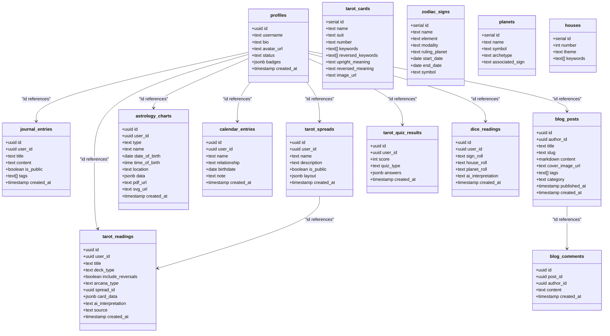

Here is a **complete Supabase SQL schema** for your Tarot & Astrology platform. It covers authentication, user profiles, readings, spreads, journals, blog system, astrology features, and more. It's modular, scalable, and indexed for performance.

---

## 🔮 Supabase SQL Schema

```sql
-- Enable Row-Level Security
alter table profiles enable row level security;
alter table journal_entries enable row level security;
alter table tarot_readings enable row level security;
alter table tarot_spreads enable row level security;
alter table astrology_charts enable row level security;
alter table calendar_entries enable row level security;
alter table blog_posts enable row level security;
alter table blog_comments enable row level security;

-- USERS (Supabase Auth handles core auth, this links profile data)
create table profiles (
  id uuid primary key references auth.users on delete cascade,
  username text unique,
  bio text,
  avatar_url text,
  status text,
  badges jsonb default '[]',
  created_at timestamp with time zone default timezone('utc'::text, now())
);

-- JOURNAL ENTRIES
create table journal_entries (
  id uuid primary key default gen_random_uuid(),
  user_id uuid references profiles(id) on delete cascade,
  title text,
  content text,
  is_public boolean default false,
  tags text[],
  created_at timestamp with time zone default timezone('utc'::text, now())
);

-- TAROT READINGS (live or imported)
create table tarot_readings (
  id uuid primary key default gen_random_uuid(),
  user_id uuid references profiles(id) on delete cascade,
  title text,
  deck_type text, -- e.g. "Rider-Waite", "Thoth"
  include_reversals boolean default true,
  arcana_type text, -- "full", "major", "minor"
  spread_id uuid references tarot_spreads(id),
  card_data jsonb, -- stores cards drawn + positions
  ai_interpretation text,
  source text, -- "live", "imported"
  created_at timestamp with time zone default timezone('utc'::text, now())
);

-- TAROT SPREADS
create table tarot_spreads (
  id uuid primary key default gen_random_uuid(),
  user_id uuid references profiles(id) on delete cascade,
  name text,
  description text,
  is_public boolean default false,
  layout jsonb, -- stores card positions and labels
  created_at timestamp with time zone default timezone('utc'::text, now())
);

-- ASTROLOGY CHARTS (birth, transit, synastry)
create table astrology_charts (
  id uuid primary key default gen_random_uuid(),
  user_id uuid references profiles(id) on delete cascade,
  type text, -- "birth", "transit", "synastry"
  name text,
  date_of_birth date,
  time_of_birth time,
  location text,
  data jsonb, -- raw chart data (from Python API)
  pdf_url text,
  svg_url text,
  created_at timestamp with time zone default timezone('utc'::text, now())
);

-- CALENDAR: FRIEND & FAMILY BIRTHDAYS / NOTES
create table calendar_entries (
  id uuid primary key default gen_random_uuid(),
  user_id uuid references profiles(id) on delete cascade,
  name text,
  relationship text,
  birthdate date,
  note text,
  created_at timestamp with time zone default timezone('utc'::text, now())
);

-- BLOG POSTS
create table blog_posts (
  id uuid primary key default gen_random_uuid(),
  author_id uuid references profiles(id) on delete set null,
  title text,
  slug text unique,
  content markdown,
  cover_image_url text,
  tags text[],
  category text,
  published_at timestamp with time zone,
  created_at timestamp with time zone default timezone('utc'::text, now())
);

-- BLOG COMMENTS
create table blog_comments (
  id uuid primary key default gen_random_uuid(),
  post_id uuid references blog_posts(id) on delete cascade,
  author_id uuid references profiles(id) on delete cascade,
  content text,
  created_at timestamp with time zone default timezone('utc'::text, now())
);

-- TAROT CARD QUIZ RESULTS
create table tarot_quiz_results (
  id uuid primary key default gen_random_uuid(),
  user_id uuid references profiles(id) on delete cascade,
  score int,
  quiz_type text,
  answers jsonb,
  created_at timestamp with time zone default timezone('utc'::text, now())
);

-- ASTROLOGY DICE ROLLS
create table dice_readings (
  id uuid primary key default gen_random_uuid(),
  user_id uuid references profiles(id) on delete cascade,
  sign_roll text,
  house_roll text,
  planet_roll text,
  ai_interpretation text,
  created_at timestamp with time zone default timezone('utc'::text, now())
);
```

---

### 🔐 Recommended RLS (Row-Level Security) Policies

Here’s a quick starter:

```sql
-- Only allow users to see their own data
create policy "Users can view their own data"
  on journal_entries for select using (user_id = auth.uid());

-- Only allow inserts from authenticated users
create policy "Users can insert their own data"
  on journal_entries for insert with check (user_id = auth.uid());
```

Replicate similar policies for each table to protect user data.

---

### 📦 Supabase Storage Buckets

Create these buckets:

- `avatars` – profile pics
- `tarot-cards` – static card image assets
- `exports` – generated PDFs / SVGs for astrology charts

---

## Seed data

Here is **seed data** for your Supabase PostgreSQL DB to populate core reference content needed for your Tarot & Astrology platform:

---

## 🃏 Tarot Cards

```sql
-- TAROT_CARDS (if not already a table, create it)
create table tarot_cards (
  id serial primary key,
  name text,
  suit text, -- "Major", "Wands", "Cups", "Swords", "Pentacles"
  number text,
  keywords text[], -- upright keywords
  reversed_keywords text[], -- reversed keywords
  upright_meaning text,
  reversed_meaning text,
  image_url text
);

-- SEED MAJOR ARCANA (abridged example, 5 cards)
insert into tarot_cards (name, suit, number, keywords, reversed_keywords, upright_meaning, reversed_meaning, image_url) values
('The Fool', 'Major', '0', array['beginnings', 'innocence', 'freedom'], array['naivety', 'recklessness', 'risk-taking'], 'New beginnings, spontaneity, free spirit', 'Naivety, foolishness, risk-taking', 'tarot-cards/major/fool.jpg'),
('The Magician', 'Major', 'I', array['manifestation', 'power', 'resourcefulness'], array['manipulation', 'untapped talents', 'poor planning'], 'Taking action, willpower, inspired focus', 'Manipulation, untapped talents', 'tarot-cards/major/magician.jpg'),
('The High Priestess', 'Major', 'II', array['intuition', 'mystery', 'spirituality'], array['secrets withheld', 'disconnected intuition', 'lack of center'], 'Inner voice, divine feminine, secrets', 'Secrets withheld, disconnected intuition', 'tarot-cards/major/high_priestess.jpg'),
('The Empress', 'Major', 'III', array['fertility', 'beauty', 'nurturing'], array['dependence', 'creative block', 'smothering'], 'Abundance, motherhood, nature', 'Dependence, creative block, smothering', 'tarot-cards/major/empress.jpg'),
('The Emperor', 'Major', 'IV', array['authority', 'structure', 'control'], array['tyranny', 'rigidity', 'domination'], 'Leadership, stability, protection', 'Tyranny, rigidity, domination', 'tarot-cards/major/emperor.jpg');
```

Let me know if you'd like **all 78 tarot cards** as a script or JSON file — I can provide that next.

---

## ♈ Astrology Reference Tables

### 🔭 Zodiac Signs

```sql
create table zodiac_signs (
  id serial primary key,
  name text,
  element text,
  modality text,
  ruling_planet text,
  start_date date,
  end_date date,
  symbol text
);

insert into zodiac_signs (name, element, modality, ruling_planet, start_date, end_date, symbol) values
('Aries', 'Fire', 'Cardinal', 'Mars', '2024-03-21', '2024-04-19', '♈'),
('Taurus', 'Earth', 'Fixed', 'Venus', '2024-04-20', '2024-05-20', '♉'),
('Gemini', 'Air', 'Mutable', 'Mercury', '2024-05-21', '2024-06-20', '♊'),
('Cancer', 'Water', 'Cardinal', 'Moon', '2024-06-21', '2024-07-22', '♋'),
('Leo', 'Fire', 'Fixed', 'Sun', '2024-07-23', '2024-08-22', '♌'),
('Virgo', 'Earth', 'Mutable', 'Mercury', '2024-08-23', '2024-09-22', '♍'),
('Libra', 'Air', 'Cardinal', 'Venus', '2024-09-23', '2024-10-22', '♎'),
('Scorpio', 'Water', 'Fixed', 'Pluto', '2024-10-23', '2024-11-21', '♏'),
('Sagittarius', 'Fire', 'Mutable', 'Jupiter', '2024-11-22', '2024-12-21', '♐'),
('Capricorn', 'Earth', 'Cardinal', 'Saturn', '2024-12-22', '2025-01-19', '♑'),
('Aquarius', 'Air', 'Fixed', 'Uranus', '2025-01-20', '2025-02-18', '♒'),
('Pisces', 'Water', 'Mutable', 'Neptune', '2025-02-19', '2025-03-20', '♓');
```

---

### 🪐 Planets (12 Total for Dice Game)

```sql
create table planets (
  id serial primary key,
  name text,
  symbol text,
  archetype text,
  associated_sign text
);

insert into planets (name, symbol, archetype, associated_sign) values
('Sun', '☉', 'Ego, vitality, identity', 'Leo'),
('Moon', '☽', 'Emotions, instincts, intuition', 'Cancer'),
('Mercury', '☿', 'Communication, intellect, reason', 'Gemini/Virgo'),
('Venus', '♀', 'Love, beauty, relationships', 'Taurus/Libra'),
('Mars', '♂', 'Action, desire, aggression', 'Aries'),
('Jupiter', '♃', 'Growth, optimism, expansion', 'Sagittarius'),
('Saturn', '♄', 'Structure, discipline, responsibility', 'Capricorn'),
('Uranus', '♅', 'Innovation, rebellion, change', 'Aquarius'),
('Neptune', '♆', 'Dreams, illusions, spirituality', 'Pisces'),
('Pluto', '♇', 'Transformation, power, rebirth', 'Scorpio'),
('North Node', '☊', 'Destiny, life purpose, spiritual growth', 'Karmic Direction'),
('South Node', '☋', 'Past life, natural talents, karma', 'Karmic Release');
```

---

### 🏠 Astrological Houses

```sql
create table houses (
  id serial primary key,
  number int,
  theme text,
  keywords text[]
);

insert into houses (number, theme, keywords) values
(1, 'Self, identity, appearance', array['personality', 'self-image', 'ego']),
(2, 'Value, possessions, income', array['money', 'security', 'self-worth']),
(3, 'Communication, siblings, learning', array['thinking', 'local travel', 'talking']),
(4, 'Home, roots, family', array['mother', 'childhood', 'foundation']),
(5, 'Creativity, romance, pleasure', array['fun', 'games', 'passion']),
(6, 'Health, service, routine', array['work', 'pets', 'responsibility']),
(7, 'Partnerships, marriage', array['relationships', 'balance', 'contracts']),
(8, 'Transformation, sex, shared resources', array['death', 'rebirth', 'inheritance']),
(9, 'Beliefs, travel, philosophy', array['religion', 'higher learning', 'expansion']),
(10, 'Career, reputation, legacy', array['father', 'ambition', 'goals']),
(11, 'Friendships, groups, community', array['networking', 'dreams', 'support']),
(12, 'Subconscious, endings, isolation', array['karma', 'spirituality', 'closure']);
```

---

Would you like the following next?

- ✅ JSON files for frontend seeds or visualizations
- ✅ Script to upload `tarot-cards` images to Supabase Storage
- ✅ Complete list of **all 78 tarot cards** with upright & reversed meanings

Let me know how you'd like to proceed.


