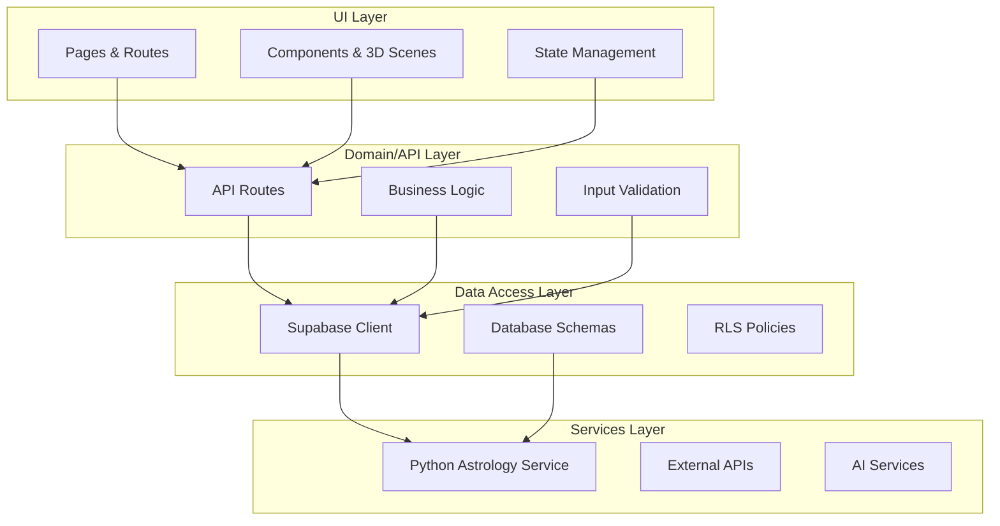

# 🏗️ Design Patterns & House Rules

A comprehensive guide to the modular, layered, API-first architecture and development practices for the Mystical Realms platform.

---

## 📋 Table of Contents

- [Architecture Overview](#architecture-overview)
- [Layer Responsibilities](#layer-responsibilities)
- [Development Standards](#development-standards)
- [Security Guidelines](#security-guidelines)
- [Performance Best Practices](#performance-best-practices)
- [Testing Strategy](#testing-strategy)
- [Code Review & Quality](#code-review--quality)
- [Team Workflows](#team-workflows)

---

## 🏛️ Architecture Overview

### Modular, Layered Design

The Mystical Realms platform follows a **four-layer architecture** that separates concerns and enables independent scaling:



### Core Principles

1. **🔗 Loose Coupling**: Each layer communicates through well-defined interfaces
2. **📦 High Cohesion**: Related functionality grouped within layers
3. **🔄 Dependency Inversion**: Higher layers depend on abstractions, not implementations
4. **🎯 Single Responsibility**: Each component has one clear purpose

---

## ⚡ Layer Responsibilities

### 🎨 **UI Layer**

- **Purpose**: User interface and interaction management
- **Technologies**: Next.js App Router, React, Babylon.js
- **Responsibilities**:
  - Page routing and navigation
  - Component rendering and state
  - User input handling
  - 3D scene management
  - Client-side data fetching

### 🔧 **Domain/API Layer**

- **Purpose**: Business logic and API orchestration
- **Technologies**: Next.js API Routes, Zod validation
- **Responsibilities**:
  - Authentication and authorization
  - Input validation and sanitization
  - Business rule enforcement
  - Service orchestration
  - Error handling and logging

### 💾 **Data Access Layer**

- **Purpose**: Data persistence and retrieval
- **Technologies**: Supabase, PostgreSQL
- **Responsibilities**:
  - CRUD operations
  - Query optimization
  - Data relationships
  - Row-level security
  - Real-time subscriptions

### 🔮 **Services Layer**

- **Purpose**: Specialized computations and external integrations
- **Technologies**: FastAPI, Python, External APIs
- **Responsibilities**:
  - Astrology calculations
  - AI/LLM integrations
  - Third-party service calls
  - Complex data processing

---

## 📏 Development Standards

### 1. **Feature-First Organization**

Organize code by **domain features**, not by technical type:

**✅ Good:**

```
features/
├── tarot-readings/
├── astrology-charts/
├── user-profile/
└── quiz-system/
```

**❌ Avoid:**

```
components/
├── buttons/
├── forms/
└── modals/
```

### 2. **Single Responsibility Principle**

Each module, component, or function should have **one clear purpose**:

**✅ Good:**

```typescript
// features/tarot-readings/hooks/useCardDraw.ts
export function useCardDraw(deckType: DeckType) {
  // Only handles card drawing logic
}

// features/tarot-readings/api/saveReading.ts
export async function saveReading(reading: TarotReading) {
  // Only handles saving readings
}
```

### 3. **Type Safety Everywhere**

- **Frontend**: TypeScript strict mode enabled
- **Backend**: Pydantic models for all schemas
- **API Contracts**: Shared type definitions

```typescript
// lib/types/tarot.ts
export interface TarotReading {
  id: string;
  userId: string;
  cards: DrawnCard[];
  interpretation: string;
  createdAt: Date;
}

// Ensure API routes use these types
export type CreateReadingRequest = Omit<TarotReading, "id" | "createdAt">;
export type CreateReadingResponse = Pick<TarotReading, "id" | "createdAt">;
```

### 4. **DRY Principle Implementation**

Extract shared logic into reusable utilities:

```typescript
// lib/utils/validation.ts
export const commonSchemas = {
  uuid: z.string().uuid(),
  timestamp: z.coerce.date(),
  email: z.string().email()
};

// lib/utils/api.ts
export function createApiResponse<T>(data: T, status = 200) {
  return NextResponse.json(data, { status });
}

export function createApiError(message: string, status = 400) {
  return NextResponse.json({ error: { message } }, { status });
}
```

---

## 🔐 Security Guidelines

### 1. **Authentication & Authorization**

- Leverage Supabase Auth for user management
- Implement Row Level Security (RLS) policies
- Validate user permissions on every API call

```sql
-- Example RLS Policy
CREATE POLICY "Users can only access their own readings"
ON tarot_readings FOR ALL
USING (auth.uid() = user_id);
```

### 2. **Input Validation**

**Frontend validation** for UX + **Backend validation** for security:

```typescript
// API route validation
import { z } from "zod";

const createReadingSchema = z.object({
  deckType: z.enum(["rider-waite", "thoth", "marseille"]),
  spreadType: z.string().min(1),
  cards: z
    .array(
      z.object({
        name: z.string(),
        position: z.number(),
        reversed: z.boolean()
      })
    )
    .min(1)
    .max(10)
});

export async function POST(request: Request) {
  try {
    const body = await request.json();
    const validatedData = createReadingSchema.parse(body);
    // Process validated data...
  } catch (error) {
    return createApiError("Invalid input data", 400);
  }
}
```

### 3. **Environment Security**

```bash
# .env.local (never commit)
NEXT_PUBLIC_SUPABASE_URL=your_url
SUPABASE_SERVICE_ROLE_KEY=your_key
OPENAI_API_KEY=your_key
SENTRY_DSN=your_dsn

# Use in code:
const supabaseKey = process.env.SUPABASE_SERVICE_ROLE_KEY!;
```

### 4. **Error Handling**

Provide **consistent error formats** without exposing sensitive data:

```typescript
// lib/errors/api-errors.ts
export class ApiError extends Error {
  constructor(
    public message: string,
    public status: number = 400,
    public code?: string
  ) {
    super(message);
  }
}

// In API routes
try {
  // ... operation
} catch (error) {
  if (error instanceof ApiError) {
    return createApiError(error.message, error.status);
  }

  // Log full error for debugging
  console.error("Unexpected error:", error);

  // Return generic message to user
  return createApiError("An unexpected error occurred", 500);
}
```

---

## ⚡ Performance Best Practices

### 1. **Caching Strategy**

```typescript
// For relatively static content
export const revalidate = 3600; // 1 hour

// For dynamic content with SWR
import useSWR from "swr";

function useUserReadings(userId: string) {
  return useSWR(`/api/users/${userId}/readings`, fetcher, {
    revalidateOnFocus: false,
    revalidateOnReconnect: true,
    dedupingInterval: 60000 // 1 minute
  });
}
```

### 2. **Lazy Loading**

```typescript
// Heavy 3D components
const BabylonScene = lazy(() => import("@/components/3d/BabylonScene"));

// In component
function SpreadCreator() {
  const [showScene, setShowScene] = useState(false);

  return (
    <div>
      <button onClick={() => setShowScene(true)}>Open 3D Creator</button>

      {showScene && (
        <Suspense fallback={<LoadingSpinner />}>
          <BabylonScene />
        </Suspense>
      )}
    </div>
  );
}
```

### 3. **Database Query Optimization**

```sql
-- Use proper indexes for common queries
CREATE INDEX idx_readings_user_created
ON tarot_readings (user_id, created_at DESC);

-- Limit results and use pagination
SELECT * FROM tarot_readings
WHERE user_id = $1
ORDER BY created_at DESC
LIMIT 20 OFFSET $2;
```

---

## 🧪 Testing Strategy

### Testing Pyramid

1. **Unit Tests (70%)**: Fast, isolated function testing
2. **Integration Tests (20%)**: API endpoint and database interaction testing
3. **E2E Tests (10%)**: Critical user flow testing

### Implementation Guidelines

```typescript
// Unit test example
// features/tarot-readings/utils/cardShuffle.test.ts
describe("cardShuffle", () => {
  it("should return specified number of cards", () => {
    const deck = createStandardDeck();
    const drawn = shuffleAndDraw(deck, 3);

    expect(drawn).toHaveLength(3);
    expect(drawn.every((card) => deck.includes(card))).toBe(true);
  });
});

// Integration test example
// tests/api/readings.test.ts
describe("/api/readings", () => {
  it("should create reading for authenticated user", async () => {
    const response = await request(app)
      .post("/api/readings")
      .set("Authorization", `Bearer ${validToken}`)
      .send(validReadingData);

    expect(response.status).toBe(201);
    expect(response.body.id).toBeDefined();
  });
});
```

---

## 📋 Code Review & Quality

### PR Requirements Checklist

- [ ] **Description**: Clear explanation of changes and reasoning
- [ ] **Tests**: Unit tests for new logic, integration tests for API changes
- [ ] **Types**: All new code properly typed
- [ ] **Documentation**: JSDoc comments for public functions
- [ ] **Performance**: No obvious performance regressions
- [ ] **Security**: Input validation and auth checks in place
- [ ] **Accessibility**: UI changes meet WCAG guidelines

### Commit Standards

Follow [Conventional Commits](https://www.conventionalcommits.org/):

```bash
feat(tarot): add custom spread creator
fix(auth): resolve session timeout issue
docs(api): update authentication endpoints
test(quiz): add unit tests for scoring logic
refactor(ui): extract reusable card component
```

### Code Quality Tools

```json
// package.json
{
  "scripts": {
    "lint": "eslint . --ext .ts,.tsx",
    "type-check": "tsc --noEmit",
    "test": "jest",
    "test:e2e": "playwright test"
  },
  "husky": {
    "hooks": {
      "pre-commit": "lint-staged"
    }
  },
  "lint-staged": {
    "*.{ts,tsx}": ["eslint --fix", "prettier --write"]
  }
}
```

---

## 👥 Team Workflows

### Sprint Planning

1. **Sprint Kickoff**

   - Review user stories and acceptance criteria
   - Break down tasks into manageable chunks
   - Identify dependencies and blockers
   - Assign clear ownership

2. **Task Management**
   - Use GitHub Projects or similar Kanban board
   - Label tasks: `frontend`, `backend`, `astro-service`, `3d`, `testing`
   - Track progress with clear status updates

### Documentation Standards

1. **Inline Documentation**

   ```typescript
   /**
    * Draws cards from a tarot deck using Fisher-Yates shuffle
    * @param deck - Array of available cards
    * @param count - Number of cards to draw
    * @param allowReversals - Whether cards can be drawn reversed
    * @returns Array of drawn cards with position and reversal info
    */
   export function drawCards(
     deck: TarotCard[],
     count: number,
     allowReversals = false
   ): DrawnCard[] {
     // Implementation...
   }
   ```

2. **Architecture Documentation**
   - README files for each major module
   - API documentation with OpenAPI specs
   - Database schema documentation
   - Deployment and setup guides

### Monitoring & Observability

```typescript
// lib/monitoring/sentry.ts
import * as Sentry from "@sentry/nextjs";

Sentry.init({
  dsn: process.env.SENTRY_DSN,
  environment: process.env.NODE_ENV,
  tracesSampleRate: 0.1
});

// Usage in API routes
export async function POST(request: Request) {
  const transaction = Sentry.startTransaction({
    name: "Create Tarot Reading",
    op: "api"
  });

  try {
    // ... business logic
    transaction.setStatus("ok");
  } catch (error) {
    transaction.setStatus("internal_error");
    Sentry.captureException(error);
    throw error;
  } finally {
    transaction.finish();
  }
}
```

---

## 🎯 Summary

By following these house rules and architectural principles:

- **🏗️ Maintainability**: Clear separation of concerns and modular design
- **🚀 Scalability**: Layer-based architecture supports independent scaling
- **🔒 Security**: Defense-in-depth with validation at every layer
- **⚡ Performance**: Optimized caching and lazy loading strategies
- **🧪 Quality**: Comprehensive testing and code review processes
- **👥 Collaboration**: Clear workflows and documentation standards

These guidelines ensure the Mystical Realms platform remains **clean, predictable, and easy to evolve** as new features are added and the team grows.
