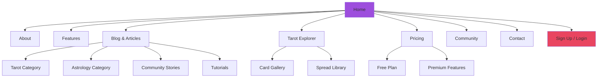
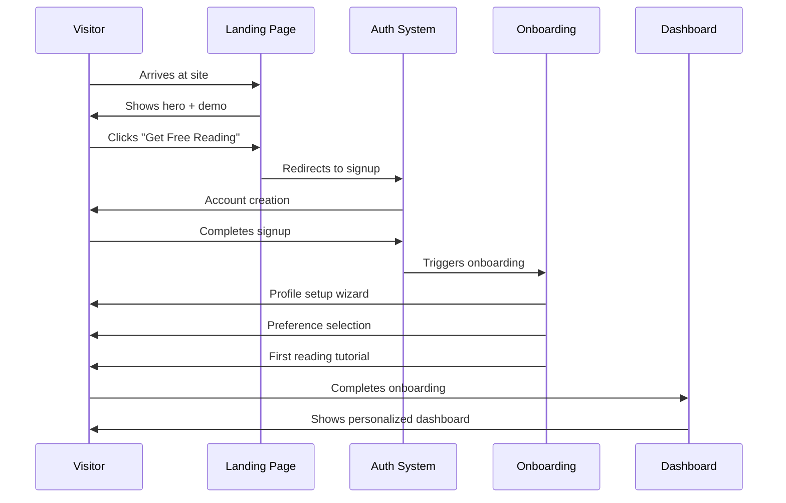
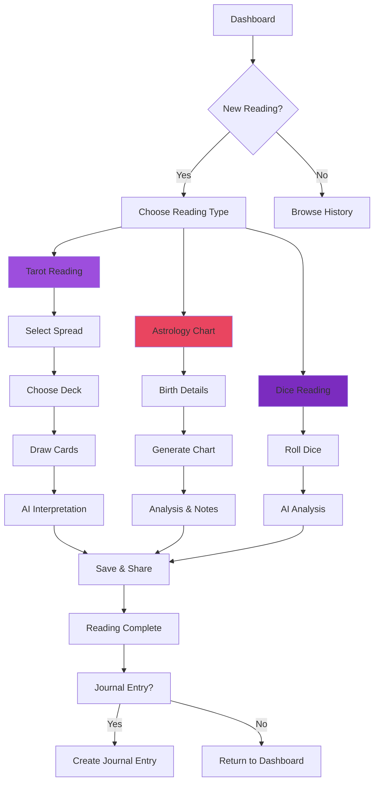
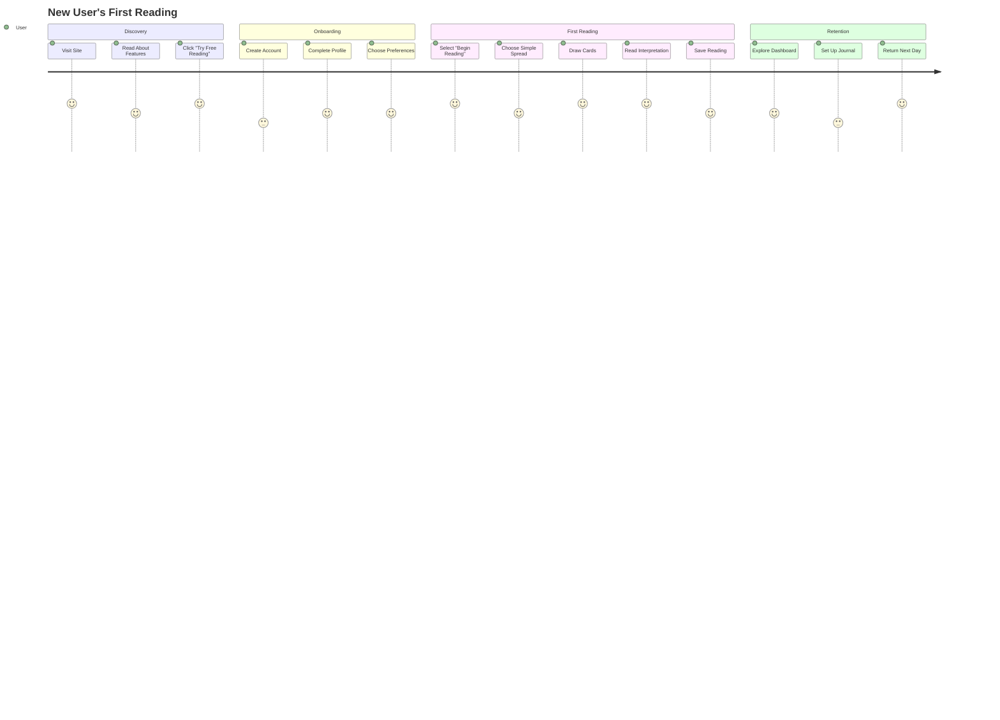
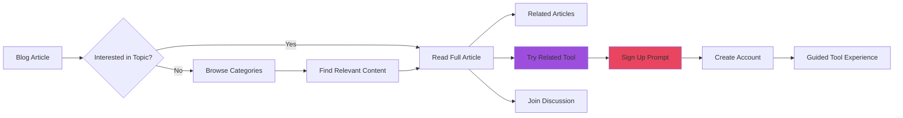

# 🗺️ Sitemap & User Flow Architecture

_A comprehensive guide to the navigation structure, user journeys, and page hierarchies for the Mystical Realms platform._

---

## 📋 Table of Contents

- [Site Architecture Overview](#site-architecture-overview)
- [Public Pages](#public-pages)
- [Authenticated Application](#authenticated-application)
- [User Journey Flows](#user-journey-flows)
- [Page Feature Breakdown](#page-feature-breakdown)
- [Navigation Patterns](#navigation-patterns)
- [Implementation Guidelines](#implementation-guidelines)

---

## 🏗️ Site Architecture Overview

The Mystical Realms platform follows a clear separation between public marketing pages and the authenticated application shell.

### High-Level Structure

```
mysticalrealms.app/
├── 🌐 Public Domain (Marketing & Content)
│   ├── Landing & Marketing Pages
│   ├── Content & Blog System
│   └── Authentication Entry Points
│
└── 🔐 Authenticated Application
    ├── Personal Dashboard & Tools
    ├── Interactive Features
    └── Community & Social Features
```

---

## 🌐 Public Pages

### Navigation Structure



### Page Feature Matrix

| Page               | Features                           | CTAs                          | SEO Priority |
| ------------------ | ---------------------------------- | ----------------------------- | ------------ |
| **Home**           | Hero, Features, Testimonials, Demo | "Get Free Reading", "Sign Up" | 🔴 High      |
| **About**          | Mission, Team, Story               | "Join Community"              | 🟡 Medium    |
| **Features**       | Service Deep-dive, Screenshots     | "Try Free", "See Pricing"     | 🔴 High      |
| **Blog**           | Article List, Categories, Search   | "Read More", "Subscribe"      | 🔴 High      |
| **Tarot Explorer** | Card Gallery, Meanings             | "Sign Up for Readings"        | 🟡 Medium    |
| **Pricing**        | Plan Comparison, FAQ               | "Start Free Trial"            | 🔴 High      |
| **Community**      | User Stories, Events               | "Join Discord", "Sign Up"     | 🟢 Low       |
| **Contact**        | Form, Support, Social Links        | "Get Support"                 | 🟢 Low       |

---

## 🔐 Authenticated Application

### Application Shell Structure

```mermaid
graph TB
    subgraph "Main Navigation"
        A[Dashboard]
        B[Readings]
        C[Journal]
        D[Tools]
        E[Learn]
        F[Profile]
    end

    subgraph "Dashboard Features"
        A --> A1[News Feed]
        A --> A2[Card of the Day]
        A --> A3[Daily Horoscope]
        A --> A4[Recent Activity]
        A --> A5[Quick Actions]
    end

    subgraph "Reading Tools"
        B --> B1[New Reading]
        B --> B2[Reading History]
        B --> B3[Spread Creator]
        B --> B4[AI Interpretations]
    end

    subgraph "Personal Tools"
        C --> C1[Journal Entries]
        C --> C2[Reading Notes]
        C --> C3[Calendar Events]

        D --> D1[Birth Chart]
        D --> D2[Transit Analysis]
        D --> D3[Dice Reading]
        D --> D4[Compatibility]
    end

    subgraph "Learning & Community"
        E --> E1[Knowledge Base]
        E --> E2[Quiz Games]
        E --> E3[Tutorials]

        F --> F1[Profile Settings]
        F --> F2[Badges & Progress]
        F --> F3[Social Features]
    end

    style A fill:#9d4edd
    style B fill:#e94560
    style C fill:#7b2cbf
    style D fill:#4b1e6b
```



---

## 🛣️ User Journey Flows

### New User Onboarding Flow



### Reading Creation Flow



---

## 📄 Page Feature Breakdown

### Dashboard (`/dashboard`)

**Primary Features:**

- **News Feed**: Community posts, shared readings, platform updates
- **Card of the Day**: Daily card with interpretation and journaling prompt
- **Daily Horoscope**: Personalized based on user's birth chart
- **Quick Actions**: New reading, journal entry, calendar event
- **Recent Activity**: Last readings, journal entries, quiz results
- **Upcoming Events**: Personal calendar, community events

**Secondary Features:**

- **Progress Tracking**: Reading streaks, journal consistency, learning badges
- **Recommendations**: Suggested content based on interests
- **Community Highlights**: Featured user content

### Live Tarot Reading (`/readings/new`)

**Step-by-Step Flow:**

1. **Spread Selection** - Choose from library or custom spreads
2. **Deck Configuration** - Select deck, enable reversals, majors-only
3. **Question Setting** - Optional question or intention
4. **Card Drawing** - Interactive 3D card selection
5. **Layout Display** - Cards placed in chosen spread
6. **AI Interpretation** - Generated reading with card meanings
7. **Personal Notes** - Add custom insights and reflections
8. **Save & Share** - Export options, social sharing

**Technical Features:**

- Babylon.js 3D card interactions
- OpenAI integration for interpretations
- Real-time saving and sync
- Export to PDF/image formats

### Spread Creator (`/spread-creator`)

**Canvas Features:**

- **Drag & Drop Interface** - Babylon.js powered editor
- **Position Labeling** - Custom names and meanings for each position
- **Layout Templates** - Common patterns (Celtic Cross, Three Card, etc.)
- **Preview Mode** - Test with actual cards
- **Community Sharing** - Publish to spread library

**Creation Tools:**

- **Grid Snap** - Alignment helpers
- **Symmetry Tools** - Mirror and rotate positions
- **Theme Selection** - Visual styling options
- **Description Editor** - Rich text for spread meaning

### Astrology Tools (`/tools/astrology`)

**Birth Chart Generator:**

- **Input Form** - Date, time, location with timezone detection
- **Chart Rendering** - SVG generation with house systems
- **Aspect Analysis** - Major and minor aspects visualization
- **Planet Positions** - Detailed degree and sign information
- **Export Options** - PDF, SVG, PNG formats

**Additional Tools:**

- **Transit Analysis** - Current planetary influences
- **Synastry Charts** - Relationship compatibility
- **Solar Return** - Annual chart progression
- **Progressions** - Chart evolution over time

### Knowledge Base (`/learn`)

**Content Categories:**

- **Tarot Cards** - Individual card meanings, history, symbolism
- **Astrological Signs** - Detailed zodiac information
- **Houses & Systems** - Astrological house meanings
- **Planets & Bodies** - Planetary influences and meanings

**Interactive Features:**

- **Search & Filter** - Full-text search across all content
- **Related Content** - Smart recommendations
- **Progress Tracking** - Mark articles as read/studied
- **Bookmarking** - Save favorite articles

---

## 🧭 Navigation Patterns

### Site Footer (Present on all pages)

```typescript
// Current footer structure
const footerNavigation = {
  company: [
    { name: "About", href: "/about" },
    { name: "Features", href: "/features" },
    { name: "Pricing", href: "/pricing" },
    { name: "Contact", href: "/contact" }
  ],
  resources: [
    { name: "Blog", href: "/blog" },
    { name: "Knowledge Base", href: "/learn" },
    { name: "Tarot Explorer", href: "/explorer/tarot" },
    { name: "Community", href: "/community" }
  ],
  support: [
    { name: "Help Center", href: "/help" },
    { name: "Privacy Policy", href: "/privacy" },
    { name: "Terms of Service", href: "/terms" },
    { name: "Status", href: "/status" }
  ],
  connect: [
    { name: "Discord", href: "https://discord.gg/mysticalrealms" },
    { name: "Twitter", href: "https://twitter.com/mysticalrealms" },
    { name: "Instagram", href: "https://instagram.com/mysticalrealms" },
    { name: "Newsletter", href: "/newsletter" }
  ]
};
```

### Authenticated App Navigation

```typescript
// Main navigation structure
const mainNavigation = [
  {
    name: "Dashboard",
    href: "/dashboard",
    icon: "HomeIcon",
    badge: null
  },
  {
    name: "Readings",
    href: "/readings",
    icon: "SparklesIcon",
    children: [
      { name: "New Reading", href: "/readings/new" },
      { name: "Reading History", href: "/readings/history" },
      { name: "Spread Creator", href: "/spread-creator" }
    ]
  },
  {
    name: "Journal",
    href: "/journal",
    icon: "BookOpenIcon",
    badge: "new-entries"
  },
  {
    name: "Tools",
    href: "/tools",
    icon: "CogIcon",
    children: [
      { name: "Birth Chart", href: "/tools/birth-chart" },
      { name: "Transit Analysis", href: "/tools/transits" },
      { name: "Dice Reading", href: "/tools/dice" },
      { name: "Compatibility", href: "/tools/synastry" }
    ]
  },
  {
    name: "Learn",
    href: "/learn",
    icon: "AcademicCapIcon",
    children: [
      { name: "Knowledge Base", href: "/learn/knowledge" },
      { name: "Quiz Games", href: "/learn/quiz" },
      { name: "Tutorials", href: "/learn/tutorials" }
    ]
  }
];
```

---

## 🎯 Critical User Flows

### First-Time Reading Experience



### Content Discovery Flow



---

## 🚀 Implementation Guidelines

### URL Structure

```typescript
// Public routes
const publicRoutes = {
  "/": "Landing page",
  "/about": "About page",
  "/features": "Features overview",
  "/pricing": "Pricing plans",
  "/blog": "Blog listing",
  "/blog/[slug]": "Individual blog post",
  "/explorer/tarot": "Public tarot card gallery",
  "/community": "Community overview",
  "/contact": "Contact form",
  "/help": "Help center",
  "/privacy": "Privacy policy",
  "/terms": "Terms of service"
};

// Authenticated routes
const authenticatedRoutes = {
  "/dashboard": "User dashboard",
  "/readings/new": "Create new reading",
  "/readings/[id]": "View saved reading",
  "/readings/history": "Reading history",
  "/spread-creator": "Create custom spreads",
  "/journal": "Journal entries list",
  "/journal/[id]": "Individual journal entry",
  "/tools/birth-chart": "Birth chart generator",
  "/tools/transits": "Transit analysis",
  "/tools/dice": "Dice reading",
  "/tools/synastry": "Compatibility analysis",
  "/learn/knowledge": "Knowledge base",
  "/learn/quiz": "Quiz games",
  "/profile": "User profile",
  "/settings": "Account settings"
};
```

### SEO & Meta Configuration

```typescript
// Page metadata structure
interface PageMeta {
  title: string;
  description: string;
  keywords: string[];
  ogImage?: string;
  canonicalUrl: string;
  structuredData?: object;
}

// Example configurations
const pageMetadata: Record<string, PageMeta> = {
  "/": {
    title: "Mystical Realms - Tarot & Astrology Platform",
    description:
      "Explore tarot readings, astrology charts, and mystical insights with AI-powered interpretations.",
    keywords: ["tarot", "astrology", "divination", "readings"],
    canonicalUrl: "https://mysticalrealms.app",
    structuredData: { "@type": "WebSite" }
  },
  "/blog": {
    title: "Mystical Blog - Tarot & Astrology Articles",
    description:
      "Discover insights, tutorials, and community stories about tarot, astrology, and spiritual practices.",
    keywords: ["tarot blog", "astrology articles", "spiritual insights"],
    canonicalUrl: "https://mysticalrealms.app/blog"
  }
};
```

### Responsive Breakpoints

```typescript
// Navigation behavior by screen size
const navigationConfig = {
  mobile: {
    type: "bottom-tabs",
    items: ["Dashboard", "Readings", "Journal", "Profile"],
    overflow: "more-menu"
  },
  tablet: {
    type: "sidebar-collapsed",
    expandOnHover: true
  },
  desktop: {
    type: "sidebar-expanded",
    width: "240px"
  }
};
```

---

## 📊 Analytics & Tracking

### Key Metrics by Page Type

| Page Category | Primary Metrics                         | Secondary Metrics                  |
| ------------- | --------------------------------------- | ---------------------------------- |
| **Landing**   | Conversion rate, Bounce rate            | Time on page, Scroll depth         |
| **Blog**      | Page views, Social shares               | Reading completion, Related clicks |
| **Dashboard** | Daily active users, Session duration    | Feature usage, Return visits       |
| **Tools**     | Tool completion rate, Export actions    | Error rates, Help requests         |
| **Community** | Engagement rate, User-generated content | Comments, Shares                   |

### User Journey Tracking

```typescript
// Event tracking structure
interface UserEvent {
  category: "navigation" | "engagement" | "conversion" | "error";
  action: string;
  label?: string;
  value?: number;
  userId?: string;
  sessionId: string;
  timestamp: Date;
}

// Example tracking points
const trackingEvents = [
  "page_view",
  "cta_click",
  "reading_started",
  "reading_completed",
  "journal_entry_created",
  "tool_used",
  "content_shared",
  "search_performed",
  "error_encountered"
];
```

---

This comprehensive sitemap serves as the blueprint for user navigation and experience throughout the Mystical Realms platform, ensuring intuitive flows while supporting both discovery and deep engagement with the platform's features.

**Related Documentation:**

- [Public Pages Layout](public_pages_layout.md) - Detailed public page designs
- [House Rules](house_rules.md) - Implementation patterns
- [Database Schema](database_schema_complete.md) - Data structure
- [Design Principles](design_principles.md) - Visual guidelines
