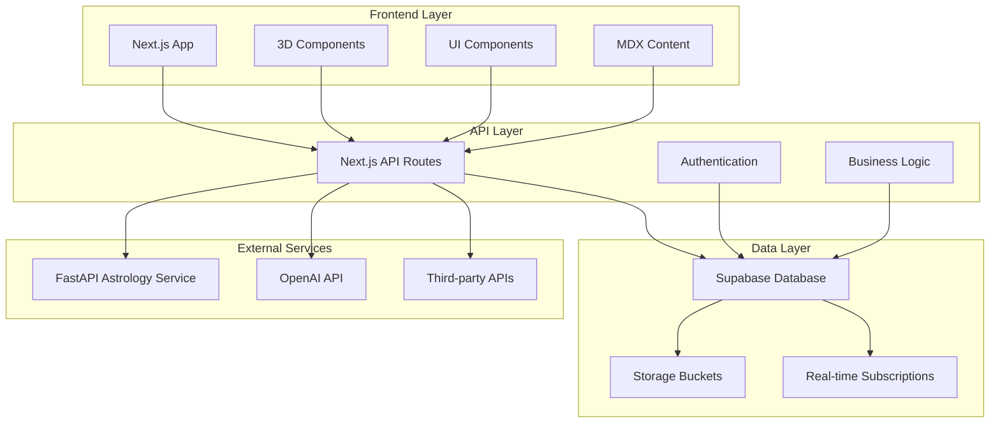
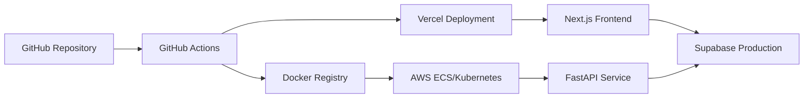

# 🛠️ Tech Stack & Architecture Roadmap

_A comprehensive guide to the technology choices, architecture decisions, and implementation roadmap for the Mystical Realms platform._

---

## 📋 Table of Contents

- [Technology Stack](#technology-stack)
- [Architecture Overview](#architecture-overview)
- [Implementation Roadmap](#implementation-roadmap)
- [Sprint Planning](#sprint-planning)
- [Deployment Strategy](#deployment-strategy)
- [Future Considerations](#future-considerations)

---

## 🏗️ Technology Stack

### Frontend Layer

- **Framework**: [Next.js 14](https://nextjs.org/) (TypeScript)

  - Server-side rendering and static site generation
  - File-based routing with App Router
  - Built-in API routes for backend orchestration
  - Optimized performance with automatic code splitting

- **3D Graphics**: [Babylon.js](https://babylonjs.com/)

  - Integrated React components for Spread Creator
  - Immersive tarot reading experiences
  - 3D dice rolling mechanics
  - WebGL-powered mystical environments

- **UI Framework**:

  - [TailwindCSS](https://tailwindcss.com/) for utility-first styling
  - [Radix UI](https://radix-ui.com/) for accessible, unstyled primitives
  - Custom design system based on [design principles](design_principles.md)

- **State Management**:

  - [React Query](https://tanstack.com/query) for server state and caching
  - [Zustand](https://zustand-demo.pmnd.rs/) for local state management
  - Optimistic updates for responsive UX

- **Content Management**:
  - [MDX](https://mdxjs.com/) with [Contentlayer](https://contentlayer.dev/)
  - Type-safe content with automated generation
  - Blog articles and knowledge base integration

### Backend Services

- **Primary API**: Next.js API Routes (Node.js)

  - User-facing endpoints
  - Supabase orchestration
  - Authentication middleware
  - Business logic coordination

- **Astrology Microservice**: [FastAPI](https://fastapi.tiangolo.com/) (Python)
  - Containerized service for astrological calculations
  - [Swiss Ephemeris](https://www.astro.com/swisseph/) integration
  - Chart generation (SVG/PDF export)
  - RESTful endpoints for birth charts, transits, synastry

### Database & Authentication

- **Primary Database**: [Supabase](https://supabase.com/) (PostgreSQL)

  - Real-time subscriptions for feeds
  - Row-level security (RLS) policies
  - Built-in authentication with OAuth providers
  - Edge functions for complex operations

- **Storage**: Supabase Storage Buckets
  - Tarot card images and deck assets
  - User avatars and profile images
  - Generated PDF charts and reports

### AI & External Services

- **Language Models**: OpenAI GPT-4 (or preferred LLM)

  - Tarot reading interpretations
  - Astrology dice analysis
  - Content generation assistance

- **Additional APIs**:
  - Horoscope data providers
  - Historical astrology events
  - Weather/lunar phase integration

---

## 🏛️ Architecture Overview

### Design Principles

- **Modular Architecture**: Clear separation of concerns across layers
- **Type Safety**: End-to-end TypeScript with Zod validation
- **Performance First**: SSR, caching, and lazy loading strategies
- **Security by Default**: RLS policies and input sanitization
- **Scalable Design**: Microservices ready for independent scaling

---

## 🚀 Implementation Roadmap

### Sprint Overview

| Sprint        | Duration | Focus Area                     | Priority    |
| ------------- | -------- | ------------------------------ | ----------- |
| **Sprint 1**  | 2 weeks  | Foundation & Infrastructure    | 🔴 Critical |
| **Sprint 2**  | 2 weeks  | Authentication & Profiles      | 🔴 Critical |
| **Sprint 3**  | 2 weeks  | Dashboard & Core Features      | 🟡 High     |
| **Sprint 4**  | 2 weeks  | Live Readings & AI Integration | 🟡 High     |
| **Sprint 5**  | 2 weeks  | Tarot Explorer & Journal       | 🟡 High     |
| **Sprint 6**  | 2 weeks  | 3D Spread Creator              | 🟢 Medium   |
| **Sprint 7**  | 2 weeks  | Astrology Microservice         | 🟡 High     |
| **Sprint 8**  | 2 weeks  | Supporting Features            | 🟢 Medium   |
| **Sprint 9**  | 2 weeks  | Content & Community            | 🟢 Medium   |
| **Sprint 10** | 2 weeks  | Polish & Performance           | 🔵 Low      |

### Detailed Sprint Breakdown

#### 🔧 Sprint 1: Foundation & Infrastructure

**Goal**: Establish development environment and core infrastructure

**Key Deliverables**:

- ✅ Monorepo setup with Next.js and Python services
- ✅ Supabase project provisioned with Auth providers
- ✅ CI/CD pipelines configured (GitHub Actions → Vercel)
- ✅ Docker containerization for Python service
- ✅ Development database schema initialization

**Technical Tasks**:

- Configure PNPM workspace with proper dependencies
- Set up ESLint, Prettier, and TypeScript configurations
- Implement basic folder structure per [house rules](design_pattern_house_rules.md)
- Configure Supabase local development environment
- Create initial database migrations

#### 🔐 Sprint 2: Authentication & Profiles

**Goal**: Secure user authentication and profile management

**Key Deliverables**:

- 🔄 Sign-up/login pages with Supabase Auth
- 🔄 User profile models and CRUD operations
- 🔄 Avatar upload with Supabase Storage
- 🔄 Badge system scaffold for gamification
- 🔄 Session management and protected routes

**Technical Tasks**:

- Implement OAuth providers (Google, Discord, GitHub)
- Create user profile schema with RLS policies
- Build reusable authentication components
- Set up middleware for route protection
- Design badge system database structure

#### 📊 Sprint 3: Dashboard & Core Features

**Goal**: Create engaging user dashboard with daily content

**Key Deliverables**:

- ⏳ Real-time news feed with Supabase subscriptions
- ⏳ Card of the Day rotating selection component
- ⏳ Daily horoscope integration (static → AI later)
- ⏳ User activity tracking and analytics
- ⏳ Responsive dashboard layout

#### 🎴 Sprint 4: Live Readings & AI Integration

**Goal**: Core tarot reading functionality with AI interpretation

**Key Deliverables**:

- ⏳ Spread selection UI with multiple layouts
- ⏳ Deck customization and card drawing simulation
- ⏳ OpenAI integration for reading interpretations
- ⏳ Reading history and saving functionality
- ⏳ Card animation and visual effects

#### 📖 Sprint 5: Tarot Explorer & Journal

**Goal**: Content discovery and personal journaling features

**Key Deliverables**:

- ⏳ Searchable card gallery with filtering
- ⏳ Tarot journal CRUD operations
- ⏳ Reading import from live sessions
- ⏳ Personal tarot library and favorites
- ⏳ Export functionality (PDF/sharing)

---

## 📋 Sprint Planning

### Sprint Structure

Each sprint follows a consistent structure aligned with agile methodology:

1. **Sprint Planning** (Day 1)

   - Review user stories and acceptance criteria
   - Break down epics into actionable tasks
   - Estimate effort and assign ownership
   - Identify dependencies and potential blockers

2. **Development Phase** (Days 2-9)

   - Daily standups for progress tracking
   - Continuous integration and testing
   - Code reviews and pair programming
   - Regular stakeholder check-ins

3. **Sprint Review & Demo** (Day 10)

   - Live demonstration of completed features
   - Stakeholder feedback collection
   - User acceptance testing
   - Performance and accessibility audits

4. **Sprint Retrospective** (Day 10)
   - Team reflection on process improvements
   - Technical debt assessment
   - Tool and workflow optimization
   - Planning for next sprint

### Definition of Done

Each user story must meet the following criteria:

- [ ] **Functionality**: Feature works as specified in acceptance criteria
- [ ] **Testing**: Unit tests with >80% coverage, integration tests for APIs
- [ ] **Code Quality**: Passes ESLint, Prettier, and TypeScript checks
- [ ] **Documentation**: JSDoc comments and README updates
- [ ] **Performance**: No significant performance regressions
- [ ] **Accessibility**: WCAG AA compliance for UI components
- [ ] **Security**: Input validation and authentication checks
- [ ] **Review**: Code reviewed and approved by team member

---

## 🚀 Deployment Strategy

### Development Environment

- **Local Development**: Supabase local instance with Docker
- **Testing**: Separate Supabase project for integration tests
- **CI/CD**: GitHub Actions for automated testing and deployment

### Production Infrastructure

### Environments

- **Development**: `dev.mysticalrealms.app`
- **Staging**: `staging.mysticalrealms.app`
- **Production**: `mysticalrealms.app`

### Monitoring & Observability

- **Frontend**: Vercel Analytics and Web Vitals
- **Backend**: Sentry error tracking and performance monitoring
- **Database**: Supabase built-in monitoring and logging
- **Infrastructure**: AWS CloudWatch for containerized services

---

## 🔮 Future Considerations

### Phase 2 Enhancements

- **Mobile Application**: React Native companion app
- **Advanced AI**: GPT-4 integration for deeper interpretations
- **Social Features**: User-to-user readings and community challenges
- **Marketplace**: Custom tarot decks and reading templates
- **Live Streaming**: Real-time group readings and events

### Scalability Planning

- **Database Sharding**: Prepare for horizontal scaling
- **CDN Integration**: CloudFront for global asset delivery
- **Microservices**: Break down monolithic API into domain services
- **Caching Strategy**: Redis for session and query caching
- **Load Balancing**: Auto-scaling groups for high availability

### Technology Evolution

- **Framework Updates**: Stay current with Next.js and React
- **AI Advancement**: Evaluate emerging language models
- **3D Optimization**: WebGPU adoption for enhanced graphics
- **Edge Computing**: Serverless functions for global performance

---

## 📊 Success Metrics

### Technical KPIs

- **Performance**: Core Web Vitals scores >90
- **Reliability**: 99.9% uptime SLA
- **Security**: Zero critical vulnerabilities
- **Code Quality**: Maintainability index >85

### User Experience Metrics

- **Engagement**: Daily active users and session duration
- **Conversion**: Sign-up to first reading completion rate
- **Retention**: 7-day and 30-day user retention
- **Satisfaction**: Net Promoter Score (NPS) tracking

---

_This roadmap serves as a living document that evolves with the project. Regular reviews ensure alignment with user needs and technical best practices._

**Related Documentation**:

- [Sprint Summary](sprint_summery.md) - Detailed task breakdowns
- [Database Schema](database_schema_complete.md) - Complete data model
- [Design Patterns](design_pattern_house_rules.md) - Architecture guidelines
- [Testing Strategy](testing_setup.md) - Quality assurance approach
