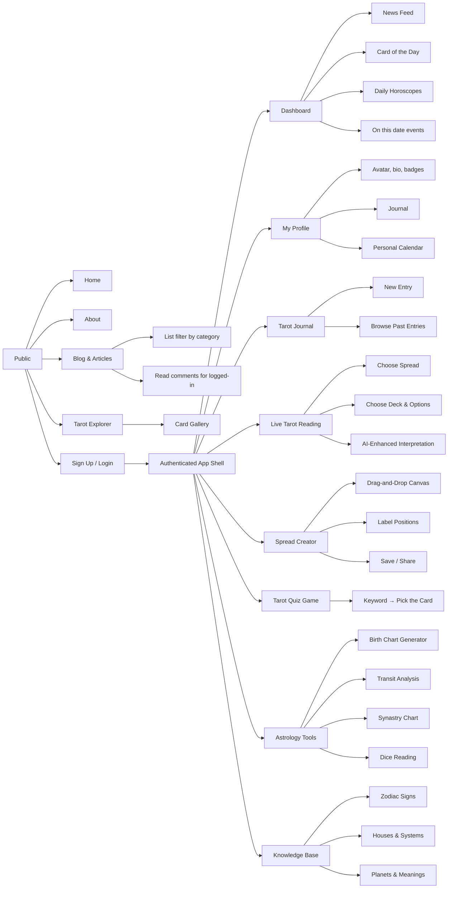

# Sitemap & Userflow

This document outlines the sitemap and user flow for the Tarot & Astrology web app, detailing both public and authenticated sections.

```asciidoc
Public
├── Home (“hero” with featured article + CTA to login/signup)
├── About (mission, community values)
├── Blog & Articles
│   ├── List (filter by category: Tarot, Astrology, Community)
│   └── Read (with comments for logged-in users)
├── Tarot Explorer
│   └── Card Gallery (search & filter)
└── Sign Up / Login

Authenticated (“App” shell w/ nav)
├── Dashboard
│   ├── News Feed (community posts, shared spreads, featured readings)
│   ├── Card of the Day
│   ├── Daily Horoscopes
│   └── “On this date” astrology/tarot events
├── My Profile
│   ├── Avatar, bio, badges & status
│   ├── Journal (private / public entries)
│   └── Personal Calendar (birthdates of family & friends)
├── Tarot Journal
│   ├── New Entry (manual / import from live reading)
│   └── Browse Past Entries
├── Live Tarot Reading
│   ├── Choose Spread (catalog)
│   ├── Choose Deck & Options (reversals, majors-only, etc.)
│   └── AI-Enhanced Interpretation
├── Spread Creator
│   ├── Drag-and-Drop Canvas
│   ├── Label Positions
│   └── Save / Share to Community
├── Tarot Quiz Game
│   └── Keyword → Pick the Card
├── Astrology Tools
│   ├── Birth Chart Generator (SVG / PDF export)
│   ├── Transit Analysis
│   ├── Synastry Chart
│   └── Dice Reading (3×12-sided + AI interpolation)
└── Knowledge Base
    ├── Zodiac Signs
    ├── Houses & Systems
    └── Planets & Meanings
```


